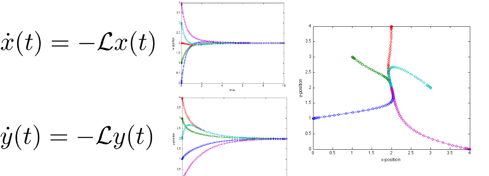
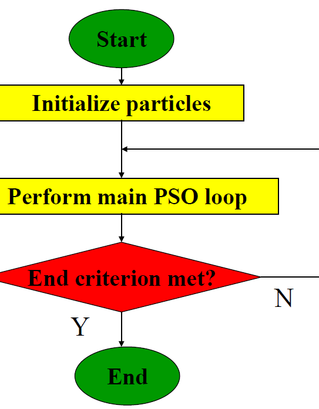
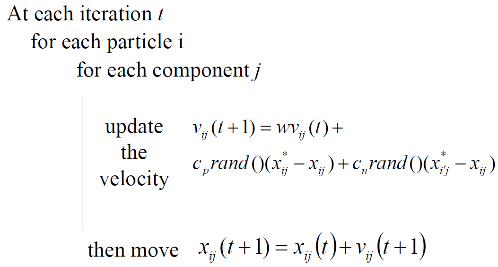
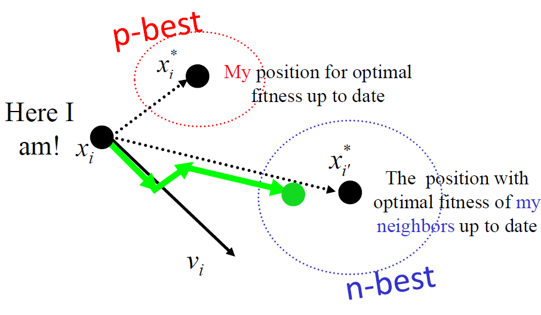
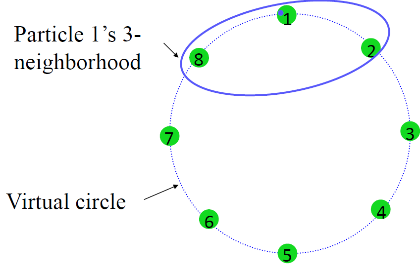
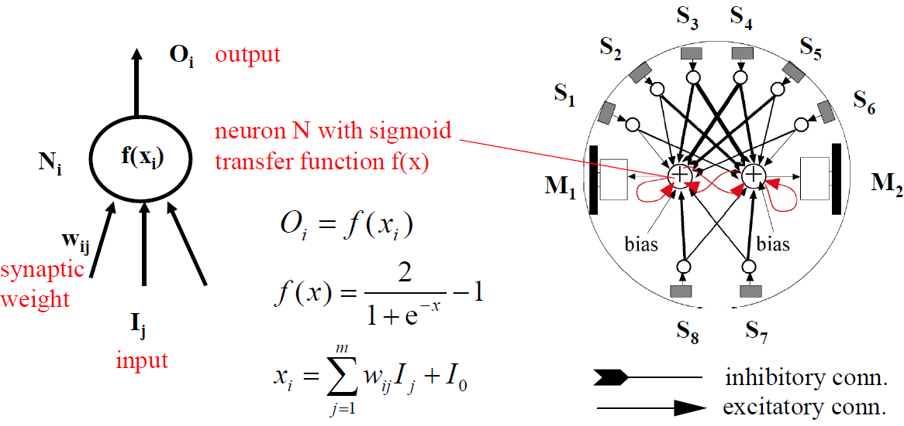

[toc]

# ENG-466_DIS_Notes

> Lecture notes by Yujie He
>
> Last updated on 2021/4/29

# Lecture1-Lecture4

:construction: To be updated!!!

# Lecture5-More on Localization Methods and an Introduction to Collective Movements

:construction: To be updated!!!

#### Boids’ Flocking Rules

1. **Separation**: **avoid collision** with nearby
2. **Alignment**: attempt to **match velocity (speed and direction)**
   with nearby
3. **Cohesion**: attempt to **stay close to** nearby

#### Boids’ Sensory System (ideal)

+ **Local, almost omni-directional** sensory system
+ **Perfect relative range and bearing system**
+ **Immediate response**: perception-to-action loop
+ **Homogeneous** system
+ **“Natural” nonlinearities**: negative exponential of
  the distance

# Lecture6-Collective Movements in Multi-Robot Systems

## 6.1 Flocking for Multi-Robot Systems

> robots to stay together while navigating in the environment as a group.

- applications: lawn-mowing, vacuum cleaning, security patrolling, overage and mapping, search and exploration in hazardous environment

### 6.1.1 Differences between digital and physical world

#### 6.1.1.1 A Real On-Board Sensory System for Flocking

compared to Boids’ Sensory System (ideal)

- In general, for real robots
  - **Noise** in the range and bearing measurement, communication
  - **Homogeneous system impossible**-small manufacturing 
    discrepancies -> calibration might be the key for an efficient system
  - **Immediate response impossible**-limited computational and sensory capacity
  - **Identifier** for each teammate possible but scalability issues-assigning ID to each robot
  - **Non holonomicity** of the vehicles-e-puck robot design
- More specifically, for **local range and bearing systems**
  - Depending on the system used for range and bearing-**occlusion possible (line of sight)**
  - **Nonlinearities** determined by the underlying technology-need control to compensate
  - **Estimation and filtering take time**: Second order variables, **velocity**, **estimated** with 2 first order measures, position, takes time; noisier signal also takes more time to filter

### 6.1.2 Examples

#### 6.1.2.1 [Kelly’s Flocking (1996)](https://citeseerx.ist.psu.edu/viewdoc/download?doi=10.1.1.2.6368&rep=rep1&type=pdf)

- Separation and cohesion only, but no alignment
- Migration script replaced by **leadership**
- using onboard IR system to local communication and sonar (ultrasound) for avoiding with robot and wall at fast speed of 10 Hz

#### 6.1.2.2 [Hayes’s Flocking (2002)](https://ieeexplore.ieee.org/stamp/stamp.jsp?tp=&arnumber=1014331) at Caltech

- a group of 10 Moorebot
- Separation, cohesion, and alignment
- Range & bearing using **off-board system** with overhead
  **camera** and **LAN radio** channel
- Different platforms (lab robots, UGVs)

### 6.2 Formations for Multi-Robot Systems

### 6.2.1 Behavior-based control strategies

> from [Balch & Arkin, 1998](https://ieeexplore.ieee.org/document/736776) [[pdf](https://ieeexplore.ieee.org/stamp/stamp.jsp?tp=&arnumber=736776)]

- **Absolute coordinate** system assumed but positional **error** considered (GPS, dead reckoning)

- **Fully networked** system but **transmission delays**
  considered (and formation traveling speed adapted4

- **Motor-schema-based** formation control

  move-to-goal, avoid-static-obstacle, avoid-robot, and maintain-formation

#### 6.2.1.1 Formation Taxonomy

- Based on formation shape: line, column, diamond, wedge

  

- Based on the reference structure (ex. on wedge): **unit-center**-referenced, **leader**-referenced, **neighbor**-referenced

  

#### 6.2.1.2 [Fredslund & Matarić (2002)](https://users-cs.au.dk/~chili/Formations/journalpaper.pdf)

> inspiring for course project

- Overview
  - **Neighbored-referenced** arch based on a **on-board relative**
    **positioning**

  - **single leader** always

  - **extreme low formation** speed (2cm/s)

  - Tested on **4 different formations mentioned before** + **switching** between them

  - Each robot has an ID under global network (broadcasted regularly)

  - a function of the formation + order in the chain (ID-based rules)

  - relative range and bearing to another robot is calculated

    

  - **Hardware for inter-robot relative positioning**-Combined use of **Laser Range Finder (LRF)** and **pan camera**

    - Relative range: LRF
    - Relative angle: through the camera pan angle;
      neighboring robot kept in the center (also for a robustness sake)
    - Neighboring robot ID via **colored visual beacon**

    

#### 6.2.1.3 [Pugh et al. (2009)](https://ieeexplore.ieee.org/abstract/document/4787109) at EPFL

> Paper in  [pdf](https://ieeexplore.ieee.org/stamp/stamp.jsp?tp=&arnumber=4787109); Spec can be found in Week 4 slides

- Khepera III robots

  - Range: 3.5 m
  - Update frequency 25 Hz with 10 neighboring robots (or 250 Hz with 1)
  - Line-Of-Sight method
  - Measure range & bearing can be coupled with standard RF channel (e.g. 802.11) for heading assessment

- **Formation Taxonomy**

  - **Neighbor-referenced** control using an **on-board relative**
    **positioning** system

  - Approach: **potential field control** (similar to Balch 1998)

  - Formations can be divided into **two categories**

    1. **Location**-based (position-based): maintain relative fixed location between teammates (x heading)

    2. **Heading**-based (pose-based): maintain relative fixed location and headings

       subset-**leader heading-based**: only the pose of leader as reference

- **Formation Localization Modes**

  - Mode 1: No relative positioning

  - Mode 2: Relative positioning -> **location**-based formation

    observe teammates with relative positioning module

  - Mode 3: Relative positioning with communication -> **Heading**-based formation

    observe and **share information with leader robot** using relative positioning and **wireless radio** (sending the heading between robots)

  **Notes**:

  - **Pose-based formations** can also be achieved by using local
    localization systems that also deliver full pose of the neighbor without communication (e.g., **multi-markers or shape detection + vision**)

- **Sample Results**

  - **Setup**: Diamond formation movement; Robot speed at the speed of 10 cm/s; Update rate at about 10-15 Hz
  - **Metric**: **average position error** for the 4 robots **respect to the prescribed diamond shape** measured with an overhead camera system
  - Conclusion
    - Without the relative positioning, the error will increase along the time compared to that using relative positioning
    - Without communication, the error is about two times than that with communication

### 6.2.2 Graph/Consensus-based (consensus-based) control strategies

- Motivation: **Graph-theory** to reconfigure, avoid obstacles, control cohesion or formation

  

#### 6.2.2.1 Graph Definitions

- Graph $G = (V, E)$, Vertex Set, Edge Set

  :exclamation: can be oriented (directed), only assume undirected graphs in this lecture

- Matrixes

  

  | Incidence Matrix                                             | Weight Matrix                                                | Laplacian Matrix                                             |
  | ------------------------------------------------------------ | ------------------------------------------------------------ | ------------------------------------------------------------ |
  | $\mathcal{I} \in \mathbb{R}^{\Vert\mathcal{V}\Vert \times\Vert\mathcal{E}\Vert}$ | $\mathcal{W} \in \mathbb{R}^{\Vert\mathcal{E}\Vert \times\Vert\mathcal{E}\Vert}$ | $\mathcal{L} \in \mathbb{R}^{\Vert\mathcal{V}\Vert \times\Vert\mathcal{V}\Vert}$ |
  | $\mathcal{I}(i, j)=\left\{\begin{array}{cl}-1, & \text { if } e_{j} \text { leaves } n_{i} \\ 1, & \text { if } e_{j} \text { enters } n_{i} \\ 0, & \text { otherwise }\end{array}\right.$ | $\mathcal{W}(i, j)=\left\{\begin{array}{cc}w_{i}, & \text { if } i=j \\ 0, & \text { otherwise }\end{array}\right.$ | $\mathcal{L}=\mathcal{I} \cdot \mathcal{W} \cdot \mathcal{I}^{\mathsf{T}}$ |
  | **Arbitrarily choosing an orientation** for any edge for undirected graph | indicate the weight associated with the edge; larger value means more important edge | if any element value (degree of node) not equal to 1, that the matrix is called weighted Laplacian matrix |
  | $I=\begin{bmatrix}-1 & -1 & 0 & 0 & 0 \\ 1 & 0 & -1 & -1 & 0 \\ 0 & 0 & 1 & 0 & -1 \\ 0 & 0 & 0 & 1 & 1 \\ 0 & 1 & 0 & 0 & 0\end{bmatrix}$ | $W=\begin{bmatrix}w_{1} & 0 & 0 & 0 & 0 \\ 0 & w_{2} & 0 & 0 & 0 \\ 0 & 0 & w_{3} & 0 & 0 \\ 0 & 0 & 0 & w_{4} & 0 \\ 0 & 0 & 0 & 0 & w_{5}\end{bmatrix}$ | $L=\begin{bmatrix}2 & -1 & 0 & 0 & -1 \\-1 & 3 & -1 & -1 & 0 \\0 & -1 & 2 & -1 & 0 \\0 & -1 & -1 & 2 & 0 \\-1 & 0 & 0 & 0 & 1\end{bmatrix}$ |

  :bulb: Ref: <https://www.cis.upenn.edu/~cis515/cis515-14-graphlap.pdf>

#### 6.2.2.2 The *Rendezvous* (会合) Problem

- **Formulation** (1D)

  - Each node is given a state $x_i$ as time tends to infinity

  - Final consensus value **not pre-established** but consensus framework (e.g., variable type, range) is **shared** and defined a priori

  - Example-5 robots $R_i$ moving on 1D measuring distances $d_{ij}$

    

  - :bulb:Note: to construct a consensus-based control law; don't need a fully-connected graph in real-world task

- **Solution**

  - use the Laplacian matrix: $\dot{x}(t) = - \mathcal{L}x(t)$, which is is equivalent to 

    $\dot{x}_{i}=\sum_{\mathbf{R}_{j} \in \mathcal{N}_{i}} w_{i j}\left(x_{j}-x_{i}\right)$

    where $\mathbf{R}_{j}$ and  $\mathcal{N}_{i}$ indicate the robot $j$ and neighborhood of robot $i$.

  - If $w_{ij} > 0$, graph connected, rendezvous is guaranteed.

- **Generalization** (2D or more): solve the problem for each dimension separately

  

- **Holonomicity** for *Rendezvous*

  - definition: total number of degree of freedom = number of controllable degree of freedom
  - From the point of view of mobility: a mobile robot is holonomic if it can **move in any direction at any point in time.**

  

  - **Considerations**

    - Laplacian method gives the **direction vector** at each point in time
- **holonomic** robots we can simply go in that direction while **non-holonomic** **need to transform the**
      **direction vector** in something useable by the robots given their mobility constraints
  - **Solution for non-holonomicity**
  
    - (Using **global** localization system) Derive transformation: total degrees of freedom (DOFs) -> controllable DOFs, and eventually to actuator control via the inverse kinematic model
  
      - all about finding the right function f such that $\left[\begin{array}{c}u \\ \omega\end{array}\right]=f(\dot{x}, \dot{y})$
        - :exclamation: rendez-vous is **not supposed to find consensus on the full pose, only position**
      - procedure: The motion is directed toward the goal; speed is proportional to the distance to that goal (nonlinear but proportional controller)
  - (Using **relative/local** localization system) Apply relative range and bearing
	
	  | Global                                                       | Relative                                                     |
	  | ------------------------------------------------------------ | ------------------------------------------------------------ |
	  | transform the global coordinates to local coordinates  |  |
	  | associate the controller DoF with local coordinates  | $\begin{aligned} u &=K_{u} e \cos \alpha \\ w &=K_{w} \alpha \end{aligned}$ |

#### 6.2.2.3 Reconfiguring

- Motivation: exploit the consensus for robots to reach prescribed points from random initialization

  

- Configurations Using a Bias

  - by adding a bias vector, we can modify the state (or assumed position): $\dot{x}=-\mathcal{L}(x(t)-\mathcal{B})$

  - achieve in decentralized way using relative positioning -> Each robot solves the Laplacian equation
    taking as x and y the relative coordinates of the other robots

    

#### 6.2.2.4 Real robots example [Falconi et al., ICRA 2010]

>  [Gowal S., Falconi R., and Martinoli A., “Local Graph-based Distributed Control for Safe Highway Platooning”. Proc. of the 2010 IEEE/RSJ Int. Conf. on Intelligent Robots and Systems, October 2010, Taipei, Taiwan, pp. 6070-6076.](https://core.ac.uk/download/pdf/147963897.pdf)

#### 6.2.2.5 Adding obstacle avoidance/cohesion control

- Can we do? Yes, we can change $\mathcal{W}$ in $\mathcal{L}=\mathcal{I} \cdot \mathcal{W} \cdot \mathcal{I}^{\mathsf{T}}$

- **Obstacle avoidance**

  1. **propagate** the **position** of the detected **obstacle** to **other robots**
  2. Each robot **updates** its neighbors list if necessary by **adding a repulsive agent**

  

  - **Positive** weights will **attract** vehicles together while **negative** weights will create a **repulsion** mechanism

#### 6.2.2.6 Graph-Based Formation Control [Falconi et al., ICRA 2010]

> https://doi.org/10.1109/IROS.2010.5649318

- to enable a group of robots (the followers) to follow a robotic leader

- we can also modify the control law (**PI controller**)

  For example, single leader moving **at a constant velocity**, we can **add an integral term**

  $\begin{aligned} u &=K_{u} e \cos \alpha+K_{I} \int_{0}^{t} e \mathrm{~d} t \\ w &=K_{w} \alpha \end{aligned}$

| Task                                                         | Result                                                       |
| ------------------------------------------------------------ | ------------------------------------------------------------ |
|  |  |

#### 6.2.2.7 Additional Estimation layer [Falconi et al., 2013]

> https://link.springer.com/chapter/10.1007/978-3-319-00065-7_25
>
> PhD Thesis: https://infoscience.epfl.ch/record/187744

 to deal with noisy localization

# Lecture7-Multi-Level Modeling Methods for Swarm Robotic Systems

:construction:

# Lecture8-Multi-Level Modeling: Complex Examples and Combination with Machine Learning

:construction:

# Lecture9-An Introduction to Particle Swarm Optimization and Metaheuristic Optimization for Single-Robot Systems

## 9.1 Machine-learning-based methods

### 9.1.1 Rationale for embedded systems

#### 9.1.1.1 Why Machine Learning?

- **Complementary** to a **model**-based approaches

  **data**-driven

- Particularly powerful when **low-level details matter** (optimization) and/or **good models do not exist** (design)!

  hard to find optimal

- **Automatic** design and optimization techniques

- Individual real-time **adaptation to new or unpredictable** environmental/system **conditions**

- **Role of the engineer refocused to performance** specification, problem encoding, and customization of algorithmic parameters (and perhaps operators)

#### 9.1.1.2 Why Metaheuristic Methods?

- design/optimization space is too large (infinite)/too computationally expensive  to searched

  NP-hard problem

- robust to noise, nonlinearities, discontinuities, non-convexity, multi-modal functions

- have several possible search spaces

  parameters (continuous and discrete spaces), rules, software/hardware, structures/architectures

  可以从多个方向进行优化

### 9.1.2 Terminology

#### 9.1.2.1 Classification

- Classification Axis 1
  - **Supervised** learning: training and test data are separated; minimization of the error
  - **Unsupervised** learning: offline learning; no distinction between training and test data set; structure extraction from the data set
  - **Reinforcement** learning: online learning; no pre-established training and evaluation data sets; judges its performance according to a given metric

- Classification Axis 2

  - **In simulation**: reproduces the real scenario in simulation; the learned solutions are then downloaded onto real hardware after finish training
  - **Hybrid**: most of the time in simulation, last period of the learning process on real hardware
  - **Hardware-in-the-loop**: from the beginning on real hardware (no simulation)

- Classification Axis 3

  computational resources requirement

  - On-board: machine-learning algorithm run on the system to be learned, no external unit
  - Off-board: algorithm runs off-board and the system to be learned just **serves as embodied implementation**

- Classification Axis 4

  - Population-based (“multi-agent”): a **population** of candidate solutions is **maintained by the algorithm**; agents can **represent directly the candidate solution in the search space**

    Genetic Algorithms (individuals), Particle Swarm Optimization (particles), Ant Colony Optimization (ants/tours)

  - Hill-climbing (“single-agent”): ML algorithm works on a single candidate solution and try to improve on it

    (stochastic) gradient-based methods

#### 9.1.2.1 Selected Evaluative Machine-Learning Techniques

- **Evolutionary Computation -> population-based**
  - **Genetic Algorithms (GA)** 
  - Genetic Programming (GP)
  - Evolutionary Strategies (ES)
- **Swarm Intelligence -> population-based**
  - **Ant Colony Optimization (ACO), W1-2**
  - **Particle Swarm Optimization (PSO), W9**
- **Learning -> hill-climbing**
  - **In-Line Learning (variable thresholds), W11**
  - **In-Line Adaptive Learning, W8**
  - Reinforcement Learning (RL)

## 9.2 Particle Swarm Optimization (PSO)

### 9.2.1 Algorithm

#### 9.2.1.1 Why PSO?

- Also **comes from the Swarm Intelligence community** like ACO
- **Competitive** metaheuristic especially **on continuous optimization** problems
- Appears to **deliver competitive results with population sizes smaller** than those of other metaheuristic methods
- Well s**uited to distributed implementation** with concept of neighborhood
- **Early** formal results on **convergence**

#### 9.2.1.2 Inspiration and Principles

- Imitate, Evaluate, and Compare
- Inspired from natural phenomenon like bird flocking

#### 9.2.1.3 Terminology

- Swarm: **pool of candidate solutions** tested in one time step
- Particle: represents a candidate solution in the hyperspace
- Neighborhood: set of particles with which a given particle share performance info
- Iteration: for each iter, metaheuristi coperators is applied to generate a new pool of candidate solutions
- Fitness function: measurement of efficacy of a given candidate solution **during the evaluation span**
- Evaluation span: evaluation period of each candidate solution during a single time step
- Life span: number of iterations a candidate solution is present/survived
- Swarm manager: update parameters (velocities and position) for each particle according to the main PSO loop

#### 9.2.1.4 Algorithm Flowchart

- randomized initialization
- Ex. of end criteria: \# of time steps; best solution performance; ...

#### 9.2.1.5 The Main PSO Loop

> Example: velocity vector $v$ and position vector $x$

- Function
  - rand(): uniformly distributed random
- Parameters
  - w: velocity intertia
  - c_p: personal best coefficient/weight
  - c_n: neighborhood best coefficient/weight
- Variables
  - $x_{ij}(t)$: **position** of particle iin the j-th dimension at iteration t
  - $v_{ij}(t)$: **velocity** of particle iin the j-th dimension at iteration t
  - $x_{ij}^*(t)$: with maximal fitness, **personal best**
  - $x_{i'j}^*(t)$: with maximal fitness in the neighborhood  of particle i, **neighborhood best**

> (Eberhart, Kennedy, and Shi, 1995, 1998)

- algorithm

  

- Vector Visualization

  

#### 9.2.1.6 Neighborhood Types

> How to choose neighbor?

- Sizes

  - index **considers** also the **particle itself**

  - Local: only k neighbors considered over m particles in the population

    1 < k < m; k=1 means no information from other particles for update

  - Global: all particles

- Topology

  - Indexed
  - Geographical
  - Social
  - Random

- Exaple

  | Type                             | Visualization                                                |
  | -------------------------------- | ------------------------------------------------------------ |
  | Indexed and Circular (**lbest**) |  |
  | Geographical & Social            |  |

  

### 9.2.2 Comparison between PSO and GA

- **Genetic Algorithms (GAs)**
  - an older and widely spread metaheuristic technique
  - designed for discrete optimization problems
  - has been also applied to Evolutionary Robotics
- **PSO**: often compared with GA but it does not at all leverage evolutionary principles

#### 9.2.2.1 Comparison on Benchmark Functions

- Goal: **minimization** of a given benchmark functions
- Standard: thirty dimensions (n = 30) and a fixed number of iterations

> Pugh et al, IEEE SIS 2005
>
> :exclamation: **distributed handout but biased results (small population, limited numbers of runs)**

- Parameters
  - GA: Roulette Wheel for selection, mutation applies numerical adjustment to gene
  - PSO: lbestring topology with neighborhood of size 3
- Result
  - PSO performs better on Generalized **Rosenbrock** and **Rastrigin**
  - GA performs better on **Griewank**
  - For Sphere case, GA and PSO can both reach the optimal, but with different speed
- Overview
  - **PSO outperforms GA on most continuous optimization problems** in recent researches
  - Because of **random aspects**, very **difficult** to **analyze** either metaheuristic or **make guarantees about performance**

## 9.3 Metaheuristic optimization for single-robot systems

### 9.3.1 Examples in control design and optimization (obstacle avoidance, homing)

#### 9.3.1.1 Neural Network Controller

- evolve **synaptic weights**
- Hebbian rules for dynamic change of the weights, transfer function parameters

#### 9.3.1.2 Optimizing Robot Controllers

- worth using GA/PSO if the number of parameters to be tuned is important
- Controller optimization results in behavioral design
- Example of controller optimization using an evolutionary algorithm

#### 9.3.1.3 Evolving Obstacle Avoidance

> Floreano and Mondada 1996
>
> **with horizontal proximity sensors**
>
> GA

- **performance (fitness function)**: the robot should go as straight as possible; and rotate as less as possible
  $$
  \Phi=V(1-\sqrt{\Delta V})(1-i)
  $$
  - $V \in [0,1]$-mean speed of wheels
  - $\Delta v \in [0,1]$-absolute algebraic difference between wheel speeds
  - $i$-activation value of the sensor with the highest activity
  - Note: Fitness **accumulated during evaluation span**, normalized over number of control loops (actions).

- Implementation

  - on-line
  - off-board (PC-hosted)
  - hardware-in-the-loop
  - population-based
  - Note
    - Direction of motion **NOT encoded** in the fitness function
    - **GA automatically discovers asymmetry** in the sensory system configuration (6 front and 2 behind)

#### 9.3.1.4 Evolving Homing Behavior

> Floreano and Mondada 1996
>
> **with ground proximity sensors** to detect the ground change
>
> GA

| Setup                                                        | Sensors                                                      |
| ------------------------------------------------------------ | ------------------------------------------------------------ |
|  |  |

- **Fitness function**
  $$
  \Phi=V(1-i)
  $$

  - Fitness **accumulated** during life span, **normalized over maximal number (150) of control loops** (actions).
  - **No explicit expression of battery level/duration** in the fitness function
  - Chromosome length: 102 parameters (real-to-real encoding)
  - Generations: 240, 10 days hardware-in-the-loop evolution

### 9.3.2 Examples in system design and optimization (locomotion)

> - **Not only Control Optimization**
>
> - Automatic **Hardware-Software Co-Design and Optimization** in Simulation and Validation with Real Robots

- Evidence: Nature evolve HW and SW at the same time …

- Simulators could explore design solution with **co-evolution (co-design) of control and morphological characteristics**

  body shape, number of sensors, placement of sensors, etc.

#### 9.3.2.1 Evolving Control and Robot Morphology

> Lipson and Pollack, 2000

- Arbitrary recurrent ANN
- Passive and active (linear actuators) links
- **Fitness function**: **net distance** traveled by the center of mass in a fixed duration

- Problem: simulator not enough realistic -> not good enough **simulated friction**

#### 9.3.2.2 Issues for Evolving Real Systems by Exploiting Simulation

>  Goal of Co-design: speeding up evolution

1. Evolve in simulation, download on real HW

   hard to Bridge the simulation-reality gap

2. Evolve with real HW in the loop

   evaluation span too time consuming and fragile hardware

#### 9.3.2.3 Co-Evolution of Simulation and Reality

> Bongard, Zykov, and Lipson, 2006
>
> https://youtu.be/x579QKA6fkY

Bongard et al, Resilient Machines Through Continuous Self-Modeling, Science, 2006

## 9.4 Take Home Messages

- Machine-learning algorithms can be classified as supervised, unsupervised, and reinforcement-based

- **Evaluative** techniques are key for **robotic learning**

- **Evaluative techniques can be used for design and optimization** of behaviors whose complexity goes beyond obstacle avoidance

  不仅仅限于避障

- Two robust **population-based metaheuristics** are PSO and GA

- Metaheuristic techniques can be also used for design and optimization of hardware features with the help of simulation tools

- Co-optimization techniques (e.g., co-evolution) can be used to shape simultaneously hardware and software features or control and model/simulation features

# Misc. 

- range and bearing 距离与方位
- flocking 群
- formation control 编队控制
- Metaheuristic 元启发式的