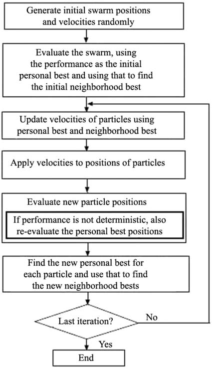
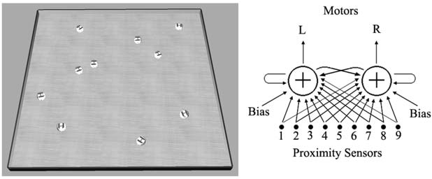

# Literature_Reading_DIS

## pugh2005SIS (week9)

> Particle swarm optimization for unsupervised robotic learning

## pugh2009SI (week10)

> Distributed scalable multi-robot learning using particle swarm optimization

### Abstract

- an adapted version of the Particle Swarm Optimization algorithm in order to accomplish distributed online robotic learning in groups of robots with access to only local information
- The effectiveness of the learning technique on a benchmark (generating **high-performance obstacle avoidance** behavior) task is **evaluated for robot groups of various sizes**, with the maximum group size allowing each robot to individually contain and manage a single PSO particle
- explore the effect of varying communication power for one of these communication-based PSO neighborhoods
- fully distributed online learning experiments are run using a group of 10 real robots

### Introduction

- achieving near-optimal performance can be very challenging

- Online robotic learning allows for automated design of efficient, robust controllers, which saves much design time and effort

- local neighborhood version of PSO -> know the state of the subset to update itself at each iteration -> scalable, parallel

- this paper explore **a modified version of PSO on groups of robots** performing distributed online learning

- case study is the generation of high-performance obstacle avoidance behavior

- At the maximum robot team size -> each robot in the group to manage a single particle

- **Simulated experiments are validated** by replicating them on a group of 10 real robots learning in parallel

- Structure

  In Sect. 3, we examine how the effectiveness of distributed online learning is affected by the number of robots in the group. Section 4 analyzes how the learning performance is affected by different neighborhood structures based on the limitations of robotic communication when each robot contains a single particle. Section 5 focuses on one such neighborhood structure and tests the effect of varying the communication range of the robots. In Sect. 6, we perform distributed learning experiments on a group of 10 real Khepera III robots in order to validate the previously obtained results from our simulations. Section 7 discusses the implications of the results and concludes the paper.

### Varying the robotic group size

- Online learning was used in previous work (Pugh et al. 2005) to **teach robots obstacle avoidance behavior for both a single robot and two robots co-learning**

- test online learning on larger robotic groups with distributed solution

- a larger robotic group -> faster learning | increase the noise in performance evaluations -> difficult to learn

- use the noise-resistant PSO algorithm from Pugh et al. (2005)

  

  - a local neighborhood in a ring topology with one neighbor on each side (lbest topology)
  - At every iteration, the previous best locations of particles are re-evaluated
  - prevents noisy performance evaluations from severely disrupting the learning process and gives significantly better results

#### simulation and experiments

- swarm size=10

- positions and velocity are set [-20,20]

- Khepera III robotic platform and Webots

- operates in a 3.0 m × 3.0

- robotic controller is a single-layer discrete-time ANN of two neurons with **nine infrared proximity sensors** as input, **wheel speed** as output, **sigmoidal function**, and **recursive connection**.

  

- weights is mapped to a separate dimension in the PSO search space with 24 dimensions (2x9 input+2x2output+2x1bias = 24)

- PSO optimization process allows the ANN weights to be tuned for improved performance as optimization proceeds,

  - performance function used by Floreano and Mondada (1996)

    $F=V \cdot(1-\sqrt{\Delta v}) \cdot(1-i)$
    $0 \leq V \leq 1$
    $0 \leq \Delta v \leq 1$
    $0 \leq i \leq 1$

  - test for team sizes of 1, 2, 5, and 10 robots. each with the same size

#### Conclusion

- Running performance **evaluations in parallel on the different robots decrease the time required for each iteration and therefore reduce the total time required for learning** (8 hours 20 minutes for 1 robot compared to 50 minutes for 10 robots)

- **single** robot (in the environment to realize obstacle avoidance) evaluation gives a higher performance than **ten** robot evaluation

- one robot learning achieves better performance for both  single and ten robot evaluation than larger group sizes

  suggests that the added **noise from having larger groups** of robots **increases the difficulty in learning**

- the decrease in performance is not particularly high while multi-robot learning can achieve 10 times speed-up

- the controller solution are **not suffering from over-fitting and allow for some generalization**. (e.g.., learn from single robot can apply on 10-robot case)

### Communication-based neighborhoods

- communication range is often limited; too communication range may also bring signal interference
- to realistically model a scalable multi-robot system, robots are **not required to communicate with other robots outside of some close proximity.**

#### Experimental setup

> Each robot contains one particle

- Model
  1. (lbest)
  2. (model A) selects the **two other robots closest to it**, and uses their particles as its neighborhood for the next iteration; **maintains the same number of particles**
  3. (model B) selects all robots **within a fixed radius r**, and uses their particles as its neighborhood for the next iteration; may **maintain variable number of neighbors**

- lbest neighborhood topology
- using r = 1.2 m, for a group of 10 robots
- average performances over 100 runs

#### results

## dimario2014ICE (week10)

> Analysis of fitness noise in particle swarm optimization: From robotic learning to benchmark functions