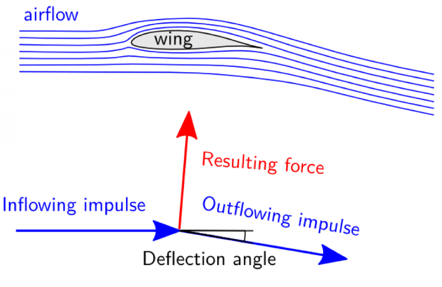
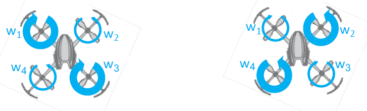
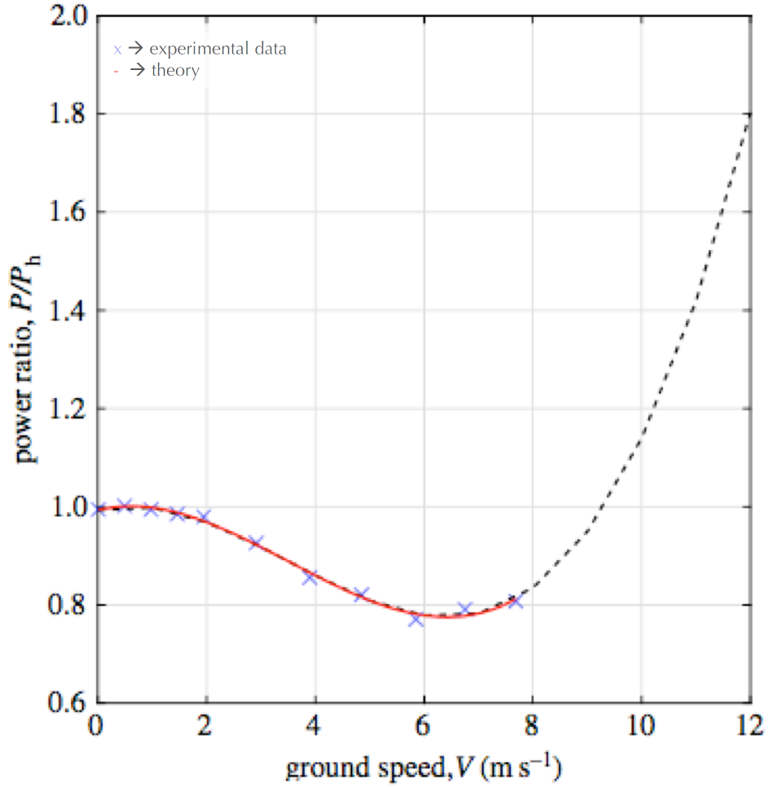
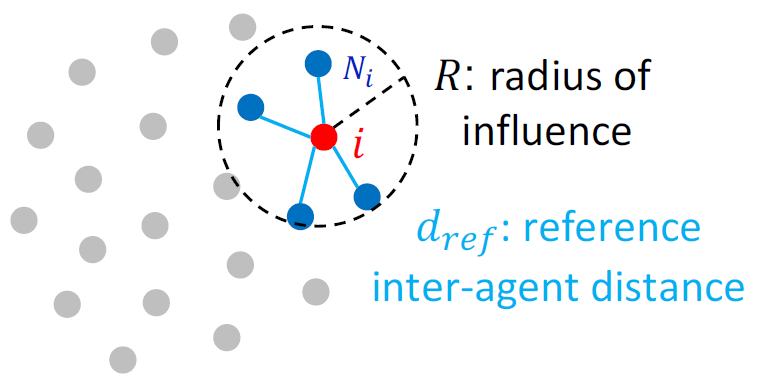
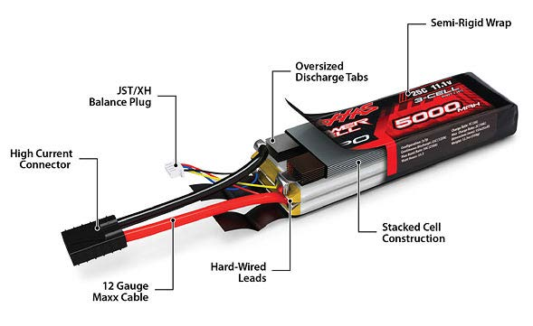
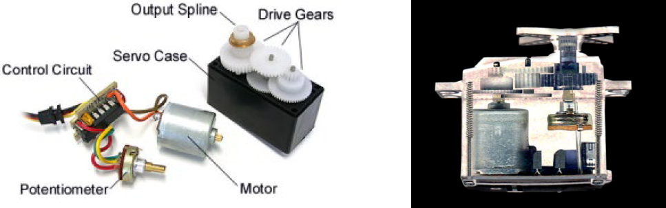
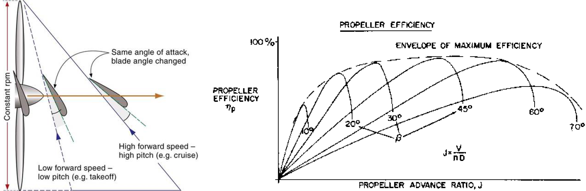
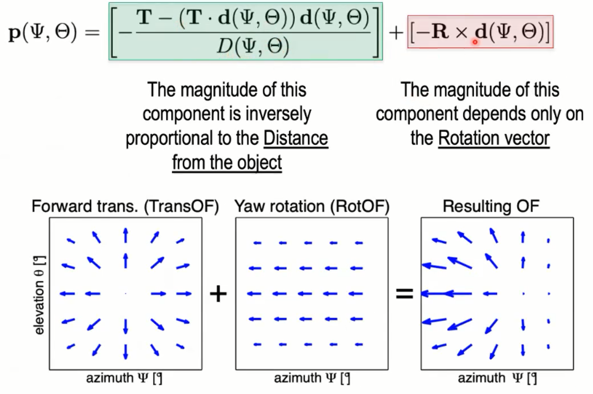
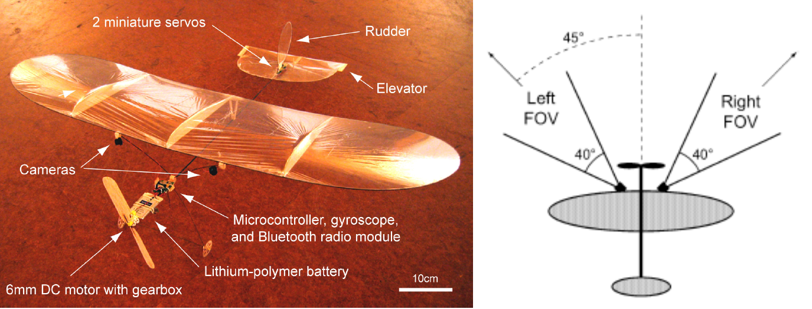
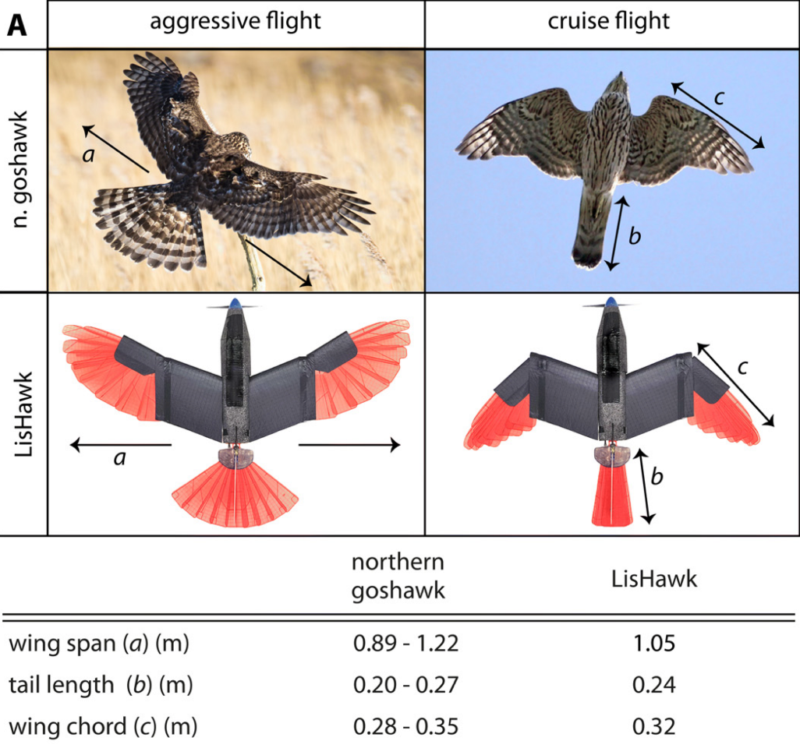

[toc]

# MICRO-502_Aerial_Robotics_Notes

> Lecture notes by Yujie He
>
> Last updated on 2021/05/04

# Intro (week1)

## Overview

- Most Civilian Drones are Small

  - flapping wings: operates in small scale; short flight time
  - rotorcraft/multicopters: in medium; could hover in place
  - fixed wings: fixed has longest flight time; cannot hover in place

- but endurance is a challenge

  

## Fixed wing Staying in the Air

generate a force **Lift** L equal and **opposite** to its own **weight** W

fixed-wing generates by airflow

- computing **lift**: $W=\frac{1}{2} C^{l} * \rho {*} V^{2} * S \approx 0.3 * 1.25 * V^2 * S$ (sea level)

  - lift coefficient $C^{l}$: proportional to angle of attack

    at cruise speed $6^{\circ}$, assuming $\frac{1}{2} C^{l}= 0.2$ 

  - Air density: decreases with the altitude

     1.25 $kg/m^3$ at sea level

  - Air speed V: fly 2x as fast -> 4x lift

  - Wing area S

- compute the required **velocity** $V = \sqrt{(W / 0.38 * S)}$

- Speed is proportional only to **wing loading** W/S $W/S = 0.38V^2$

## Maintaining constant speed V

- generate a **thrust** force T equal and opposite to **Drag** force D

- Drag  $D=\frac{1}{2} C^{d} * \rho {*} V^{2} * S = \rm{Lift}/r $

  lift-drag ratio $r = Lift/Drag$

## Major Application Fields

- Agriculture
- Energy
- Public safety & security
- Delivery

###For Agriculture

- fixed-wing

  inspection: large fields; few lights/value

- quadcopter

  spraying: small fields; high-value crops; difficult terrain

### For Energy

- stationary inspection

  fire, related to human safety

- long-range inspection

  frequent, faster inspection to powerline, gasoline

- Power generation

  strong & steady winds

### For Public safety & security

- in-vehicle

  policeman

- long-range

  **Border** patrol, fast intervention

### For Delivery

#### Category

- Long-range: fixed wing; combination of wing and rotors to cover long distance
- Short-range: multicopter

Forcast: parcel delivery > air freight in near future

#### «Can Drones Deliver?»

- Power requirement: 0.59kW

  deliver 2 kg payload at cruising speed of 45 km/h

- Energy requirement: about 0.39kWh

  deliver 2 kg payload within 10 km radius with 30 km/h headwind

  - power (kW) x distance to speed ratio (d/v) to get energy requirement (kWh)
  
- Battery & Platform: choose considerations -> cost; weight; energy density; lifetime

- Economics: Electricity/Battery cost per km

#### Last-cm delivery - Dronistics

- Packdrone + SimplyFly

  Protective foldable cage; Redundant GPS

- Temperature-control box

## Checkpoints

- For a given total mass, what type of small drones (multi-copter, fixed-wing, flapping  wing) displays the longest endurance?

  fixed-wing

  > fixed-wing drones generate lift with their wings. This means that, unlike a multirotor drone, they don't expend large amounts of energy just to stay in the air and fly more efficiently as a result

- How much faster must an intercontinental airplane fly at cruising altitude compared to sea level?

  $W=\frac{1}{2} C^{l} * \rho {*} V^{2} * S \rightarrow V = \sqrt{\frac{2W}{C^l \rho S}}$

  - sea level: $\rho = 1.25kg/m^3$
  - intercontinental airplane fly ~10000m: $\rho = 0.4135kg/m^3$

- What structural factor (i.e. not the engine) affects the cruising speed of fixed-wing  drones?

  Speed is only proportional to wing loding (W/S) = Weight/Wing area

- What are the two major drone applications in agriculture?

  Inspection and spraying

- What are the drone applications in the energy sector?

  Stationary inspection; long-range inspection; and power generation

- What are the factors to consider for calculating the cost/km of drone delivery?

  Electricity cost and battery cost

# Multicopters (week1)

|              | Fixed wing         | Flapping wing             | rotating wing                        |
| ------------ | ------------------ | ------------------------- | ------------------------------------ |
| **Examples** | airplanes, gliders | new robots                | helicopters, multicopters            |
| **Pros**     | Fast; Efficient    | Efficient                 | Can hover;Highly maneuverable        |
| **Cons**     | Cannot Hover       | Hard to build and control | Less efficient                       |
| **Features** |                    | Scale down in size        | Vertical take-off and landing (VTOL) |

## Introduction

### Rotorcrafts (helicopters vs multicopters)

> generates lift using high speed rotary blades called rotors

- Features

  - Vertical take-off and landing (VTOL)
  - Very maneuverable
  - Less efficient than fixed wing vehicle

- helicopters-Need complex variable pitch rotors

  - the tail produce a moment to counteract the force generated by main propeller blade when generating main lift
  - change the pitch of the blades (force vector) to produce translation-add complexity

- multicopters-Use multiple fixed-pitch blades

  - each spin in different directions; don't need tails due to balanced moment
  - fix pitch propellers 

  > overtaken by helicopters due to heavy workload of the pilot

### Pros and Cons

#### Pros-Easy to build and maintain

- Mechanically simple
- Does not require any complex mechanical parts
- Can move around by changing motor speed
- Can hover, takeoff, and land vertically

#### Cons

- Required energy constantly to hover
- **less efficient** than helicopters of the same size because the **thrust is generated by smaller propellers**.

## Structure and Physics

### Main components

frame; control board; Motors and motor drivers (ESC, electronic speed controller); Propellers; Battery; Receiver

### Configuration

- Four propellers generate four lift forces

- Propellers 1& 2 (CCW) have opposite pitch compared to propellers 3 & 4 (CW)

  

### Rotation speeds / Forces / Moments

> movement are controlled by changing the rotation speed of the propellers

- Force F is **proportional to square of** propeller **speed** $F_i \propto w_i^2$
- mg is the **weight** of the quadrotor
- **Moments** generated by the forces are $M_i = L \propto F_i$

### Hover conditions

1. All forces must be balanced $F_1+ F_2+ F_3+ F_4+ mg = 0$

   move up and down

2. Lift forces must be parallel to gravity $F_i \Vert g$

3. All moments must be balanced $M_1+M_2+M_3+M_4 = 0$

   pitch and roll

4. Rotor speeds must be balanced (torque balanced) $(w1+w3)-(w2+w4) =0$

   yaw

## Flight mechanics

> How to move a quadrotor around?

- **Orientation**

  

> Violating one or more of these conditions implies that **the quadcopter starts to move**

### Moving Up and Down

- **condition1**: Forces Not balanced $F_1+ F_2+ F_3+ F_4+ mg \neq 0$

### Rotating in Yaw

- Rotor speeds not balanced (torque balanced) $(w1+w3)-(w2+w4) \neq 0$

  $\dot{\psi}=k_{\psi}\left(\left({w}_{2}+{w}_{4}\right)-\left({w}_{1}+{w}_{3}\right)\right)$

- Note: opposite motor pair should increase/decrease motor speeds to keep hovering, or it will keep flying up!

### Rotation in Roll/Pitch

- Forces not parallel to gravity $F_i \nparallel mg $

- moments not balanced $M_1+M_2+M_3+M_4 \neq 0$

  $\dot{\phi}=k_{\phi}\left(\left(w_{1}+w_{4}\right)-\left(w_{2}+w_{3}\right)\right)$

  $\dot{\theta}=k_{\theta}\left(\left(w_{1}+w_{2}\right)-\left(w_{3}+w_{4}\right)\right)$

### Summary of equations

- to control the quadrotor state -> setting the rotor speeds for obtaining a desired angular rotation

  **inverse** operation

### Example-Translated flight

> Moving Forward
>
> Translated flight **requires more thrust than hovering**, but not always more power (see section 6)!

- pitch down: decrease F_1 and F_2

- hover: increase F_1 and F_2 to stop rotation

- translate: keep balance between mg and thrust $\mathbf{F} \cos \theta=-m g$

  

- pitch back

## Types of Multicopters

> main feature; fully actuated multicopters

### Configuration

- Tricopter

  - More yaw authority compared to quadcopters

    direct control of yaw

  - More complex mechanical design due to the **servo** in tail

    need additional servo to roll/pitch the back motor

- Hexacopter/Octacopter

  - More lifting capacity -> more payload
  - **Redundancy**, so robust to failure
  - Larger size; expensive

- X8 configuration

  - More lifting capacity
  - **More efficiency** thanks to the **coaxial configurations**

### Fully Actuated Multicopters

> underactuated multicopters -> all propellers are rotated in the same plane

#### Features

- Rotors disks are in different planes
- Fully Actuated to control 6 DoF (heave, roll, pitch and yaw, x and y translation) by using 6 motors

#### Pros

- Translational and rotational **dynamics** are **decoupled**
- **improved robustness to disturbances** and to perform complex manipulation tasks
- Possibility to plan **more complex trajectories**

#### Cons

- Decreased energetic efficiency

## Energetics

> What is the power consumption of a multicopter during flight?
>
> How to extend multicopters flight time?

- Multicopters have high power requirements

  inefficient compared to fixed-wing or flapping-wing aircraft

  - consume about 200 W/kg on average

  - Centimeter scale quad with LiPo -> 5-7min

  - Decimeter scale quad with LiPo ->20-30min

    changes corresponding to **weather conditions** and **aggressiveness of flight**

### Energy in hovering

- Power calculation of single motor when drone in hovering
  - Propeller efficiency ranges from 0.85 to about 0.9
  - $r_p \sqrt{\pi}$ is the squire root of the disk area
- Flight time
  - $P_i$ has high variability

### Energy in forward flight of quadcopter

- Power consumption during forward flight normalized by the power consumption at hover

  

  - lower power need but higher thrust -> aerodynamics

    tilting the quad to the side -> **artificially increase the angle of attack -> generate the increase in thrust in the given power**

  - high power ratio again

    drag increases quickly again!

### Increase flight time

1. Weight and drag reduction

2. Increase the specific power of the energy source

   switch from LiPo batteries to gasoline (far more energy stored)

3. Docking station for charging/battery swapping

4. Tether for power supply

   reduce battery

5. Improving efficiency via mechanical

6. Energy aware motion planning

   reduce acceleration (aggressive flight)

7. Multi-modal operation

   perching; walking and rolling

## Checkpoints

- What set of conditions corresponds to hovering in a quadcopter?

  Four conditions: balanced weight; parallel to weight; balanced moment (thrust x half frame); balanced rotation speed

- What set of conditions corresponds to a rotation around the yaw axis in a quadcopter?

  imbalanced rotation speed

- How the time of flight of multicopters can be increased?

- How the power consumption and total thrust evolve at different forward speeds in multicopters?

  first goes down as thus increases when angle of attack increases

  then goes down because the drag force increases again

# :construction: Attitude representations (week2)

# :construction: Control (week2&3)

# :construction: State Estimation (week3&4)

# :construction: Navigation Methods (week5)

# :construction: Perception (week5)

# :construction: Fixed-wing drones (week6)

# Aerial Swarms (week7)

## Intro

- Drone light shows

  **Centralized** = agents transmit individual position to ground computer and receive next location

- Collective Motion in nature

  **Decentralized** = agents rely on **local information and computation**

## Reynolds flocking algorithm (Reynolds, 1987)

- radius of communication or neighborhood R

- **Separation**: avoid collision
- **Cohesion**: attempt to keep close
- **Alignment**: attempt to match velocity

### Reynolds flocking: model

- Equations

  

  - Set of agents in neighborhood $N$
  - identity of $i$-th agent
  - position ${\mathbf{p}_i}$
  - velocity $\dot{\mathbf{p}}_i$
  - acceleration $\ddot{\mathbf{p}}_i$ = control command
  - acceleration term due to the cohesion/separation/alignment $\mathbf{a}_{coh,i}$, $\mathbf{a}_{sep,i}$, and $\mathbf{a}_{align,i}$
  - constant gains corresponding to the cohesion/separation/alignment $C_c$,  $C_s$, and  $C_a$

- Equilibrium

   

  - Positions **converge** to a <u>lattice formation</u> (晶格式)

  - Velocities **converge** to the <u>average of initial velocities</u>

    $\lim _{t \rightarrow \infty} \dot{\boldsymbol{p}}_{i}=\frac{\sum_{i \in\{1,2, \ldots N\}} \dot{\boldsymbol{p}}_{i}(0)}{N}$

### Reynolds flocking with migration

- new **migration rule** steers the swarm towards a desired direction

  - **replaces** the **alignment rule**
  - **cohesion and separation rules are kept** to regulate the agents distances

  

- Equation

  $\ddot{\mathbf{p}}_{i}=\mathbf{u}_{i}$, $\mathbf{u}_{i}=c_{c} \frac{\sum_{j \in N_{i}}\left(\mathbf{p}_{j}-\mathbf{p}_{i}\right)}{\left|N_{i}\right|}-c_{s} \frac{\sum_{j \in N_{i}} \frac{\mathbf{p}_{j}-p_{i}}{\left\|p_{j}-p_{i}\right\|^{2}}}{\left|N_{i}\right|}+c_m \frac{\mathbf{v}_{mig}-\dot{\mathbf{p}}_i}{1}$

  $\forall i \in\{1,2, \ldots, N\}$

  - parameters
    - migration velocity $\mathbf{v}_{mig}$
    - Denominator = 1 since **neighbors are not relevant for migration**

## Case: Aerial swarms for disaster mitigation

SMAV platform with control electronics

### Communication radius and turning angle

- large communication radius -> can make sharp turn together because of knowing the position of other robots
- smaller communication radius -> may separate and gather into a flocking often

### Virtual agents for flocking with fixed-wing drones

- Winged drone flies around Virtual Agent which moves according to Reynolds rules

  

- Varga et al., Distributed Formation Control of Fixed Wing Micro Aerial Vehicles for Uniform Area Coverage, IROS 2015

  video: <https://youtu.be/FYsd2VckGA0>

## Reynolds flocking with obstacles (Virtual agents)

- Obstacles are modelled as **virtual agents**

  - Its **position** is the obstacle’s **closest point** to the agent
  - Its **velocity** is **perpendicular to the tangent** to the obstacle

  $(\mathbf{p}_k, \dot{\mathbf{p}}_k)$ position and velocity of the virtual agent

- Virtual agents exert **separation** and **alignment** effects, but not **cohesion** (not collide with the agent)

- Visualization

  

- Equation (two extra separation and alignment term regarding obstacles)

  $\ddot{\mathbf{p}}_{i}=\mathbf{u}_{i}$

  $\mathbf{u}_{i}=c_{c} \frac{\sum_{j \in N_{i}}\left(\mathbf{p}_{j}-\mathbf{p}_{i}\right)}{\left|N_{i}\right|}-c_{s} \frac{\sum_{j \in N_{i}} \frac{\mathbf{p}_{j}-p_{i}}{\left\|p_{j}-p_{i}\right\|^{2}}}{\left|N_{i}\right|}+c_a \frac{\mathbf{v}_{mig}-\dot{\mathbf{p}}_i}{1} -\left[c_s \frac{\mathbf{p}_k - \mathbf{p}_i}{\Vert \mathbf{p}_k - \mathbf{p}_i \Vert^2} + c_a (\dot{\mathbf{p}}_k - \dot{\mathbf{p}}_i)\right]$

  $\forall i \in\{1,2, \ldots, N\}$

## Other models

### Vicsek model: particles in confined environments (密闭环境)

> Vasarhelyi et al., Optimized flocking of autonomous drones in confined environments, Science Robotics, 2019
>
> DOI: <http://doi.org/10.1126/scirobotics.aat3536>
>
> Video: https://youtu.be/E4XpyG4eMKE
>
> Project web: http://hal.elte.hu/drones/scirob2018.html

- Rules
  - **Separation**
  - **Self propulsion**: Makes the agent match a preferred speed
  - **Friction**: **Viscosity** (internal friction) for alignment and oscillation **damping**

- Equation

  $\left\{\begin{array}{l}\dot{\boldsymbol{p}}_{i}=\boldsymbol{u}_{i} \\ \boldsymbol{u}_{i}=\boldsymbol{v}_{s e p, i}+\boldsymbol{v}_{s p p, i}+\boldsymbol{v}_{\text {fric }, i}\end{array}\right.$

- The full equation contains 12 parameters and **requires heuristic methods for optimization**

### Olfati-Saber model

> R. Olfati-Saber, Flocking for multi-agent dynamic systems: algorithms and theory, IEEE Transactions
> on Automatic Control, 2006

+ Rules

  + Distance matching
    + Makes the agents **match a desired inter-agent distance**
    + **Replaces cohesion and separation** rules of Reynolds model
    + Mathematically defined as a potential function
  + Alignment: attempt to match the velocity and direction

  

+ Equation

  $\ddot{\mathbf{p}}_{i}=\mathbf{u}_{i}$

  $\mathbf{u}_{i}=c_{d} \frac{\sum_{j \in N_{i}} \nabla \left(\rho(\mathbf{p}_{j}-\mathbf{p}_{i}) V (\Vert \mathbf{p}_{j}-\mathbf{p}_{i}\Vert) \right)}{\left|N_{i}\right|}-c_{a} \frac{\sum_{j \in N_{i}} (\dot{\mathbf{p}}_{j}-\dot{\mathbf{p}}_{i})}{\left|N_{i}\right|}$

  $\forall i \in\{1,2, \ldots, N\}$

  + radius of influence $R$
  + desired inter-agent distance $d_{ref}$
  + weighting function $\rho$
  + distance matching function $V$
  + gradient, derivative in three dimensions $\nabla=\left(\frac{\partial}{\partial x}, \frac{\partial}{\partial y}, \frac{\partial}{\partial z}\right)$

+ **distance matching example**

  + Components
    + **weighting** function 越近影响越大
    + **distance matching** function 越靠近$d_{ref}$越小，线性
    + Result: **potential function**

  

  + Note
    + Principle of minimum potential: **minimum** defines the stable equilibrium of the system
    + $d_{ref}$ is a stable equilibrium
    + The force acting on an agent is zero in the minimum of the potential. For $d=d_{ref}$, it holds $\nabla(\rho V)=\mathbf{0}$

## Drone Swarms

> Coppola et al., A Survey on Swarming With Micro Air Vehicles: Fundamental Challenges and Constraints, Front. Robot. AI, ‘20

The combination of centralized planning/control with external positioning has **allowed to fly significantly larger swarms**. The **numbers are lower** for the **works featuring decentralized control with external positioning**, or centralized control with local sensing

**Three categories**

1. Centralized with external positioning

   > latest: September 20 2020
   >
   > 3,051 drones
   >
   > News: https://www.guinnessworldrecords.com/news/2020/10/3051-drones-create-spectacular-record-breaking-light-show-in-china (Company: https://www.dmduav.com/)
   >
   > YouTube: https://youtu.be/44KvHwRHb3A
   >
   > Bilibili: https://www.bilibili.com/video/BV1jt4y1q762

2. Decentralized with external positioning or centralized with on-board sensing

   Vasarhelyi et al. (2019)

3. Decentralized with on-board sensing

   Saska et al. (2017)

## Visual information in flocking

### Soria2019IRC-influence of limited visual sensing using Reynolds

> Soria et al., The influence of limited visual sensing on the Reynolds flocking algorithm, 2019

- generate flocks with different fields of view

  

  - azimuth/方位角 $\theta [^{\circ}]$
  - width $\alpha [^{\circ}]$

  

- measure flocking performance (all individuals in the flock have the same visual configuration)

  - **Order**: measure of alignment
  - **Safety**: ability to avoid collisions
  - **Union**: ability to stay informed on neighbors
  - **Connectivity**: ability to broadcast messages among drones

  

- results

  

  - focus on order and safety (alignment and collision prevention capability)
  - largest azimuth and FoV has best performance
  - increase in either azimuth or FoV only will degrade the performance
  - safety can be achieved even with lower FoV

### Schilling2019RAL-Learning to flock in simulation with vision

> Schilling et al., Learning Vision-Based Flight in Drone Swarms by Imitation, RAL2019

- use 6 cameras in each side

- training on a dataset to generate the velocity vector for the drone

- Stages
  - Dataset generation: Flocking algorithm as ground truth
  - Training phase: Learn **mapping between vision and control output**
  - Vision-based control: **Neural controller for collision-free and cohesive flight**
- Note
  - work well in simulation indoor environment
  - it can be robust when individuals has different migration points
  - cannot generalize well in background clutter and different lighting condition

### Schilling2021RAL-Learning to flock outdoor with vision

> Schilling et al., Vision-Based Drone Flocking in Outdoor Environments, RAL2021 

- Setup

  - Drone with only with 4 cameras in four side
  - RTK GNSS is used to compute performance
  - train YOLOv3 tiny to recognize other drones using YOLO

- Control method

  

  1. Real-time drone detection

     - Input: images from 4 cameras

     - Output: x,y coordinates of perceived drones in image frame coordinates

       known size to compute corresponding distance

  2. Multi-agent state tracking

     - Input: Locations of drones & noise models

     - Output: **Range and bearing** of all perceived drones with **noise**

  3. Potential-field-based control

     - Input: Range and bearing of all perceived drones
     - Output: **velocity vector** resulting from Reynolds algorithm

## Check points

- What information does each agent receive in the Reynolds flocking algorithm?

  :construction: position and velocity of self and neighbor agents

- How are obstacles modeled in Reynold’s flocking

  visual agent; integrate into equations with alignment and separation term

- How is a migration point incorporated in flocking algorithms

  :construction: add a velocity term?

- What does the Olfati-Saber algorithm ensure?

  distance matching with potent ion function

- What are the three steps of vision-based drone flocking algorithm?

  1. Real-time drone detection

  2. Multi-agent state tracking
  3. Potential-field-based control

  images from 4 cameras -> x,y coordinates of perceived drones in images -> Range and bearing of all perceived drones -> velocity vector

# :construction: Flapping-Wing (week8)

# Drone Regulations (week8)

> Author: Markus Farner
>
> https://www.bazl.admin.ch/bazl/en/home/good-to-know/drohnen.html

- Unmanned Aircraft Systems (UAS) >= Drones; UAS  = Remotely piolted aircraft systems / autonomous aircraft systems

- Rules in Aviation: Federal Office of Civil Aviation Switzerland

- Everything which is not forbidden is allowed -> Switzerland

  Trust, less difficult for innovation

- 3 Pillar Concept / Drone Categories

  1. Open-Within the legal framework (No Authorization required)
  2. Specific-Not sufficiently safe (Authorization required)
  3. Certified-Approved to accepted standards

- Act

  - **Ordinance on Special Category Aircraft**
    - No authorization required for commercial flights
    - No distinction between Unmanned Aircraft and Model Aircraft
  - **DETEC Ordinance on Special Category Aircraft**
    - No authorization below **30kg**
    - Within direct visual contact (VLOS)
    - Not within a distance <=100m around crowds
  - **ANSP (Skyguide) or Airport responsibility**
    - \> **5km** Distance to civil & military airports/aerodromes
    - < **150m** AGL (Above Ground Level) within a CTR

- Act in EU
  - Open/Specific/Certified
  - Difference
    - restrictions: MTOM **25kg**
    - maximum flying altitude: **120m** 

- Specific Category

  > Application for an operating permit on the basis of the **SORA (Specific Operations Risk Assessment)**

  **Operational Volume = Flight Geography + Contingency Volume **

  

- :question: Robustness Levels: Integrity + Assurance

- U-Space

  > The U-space is a collection of decentralized services that collectively aim to safely and efficiently integrate drones into the airspace and enable drone operations alongside manned flight.
  >
  > https://www.bazl.admin.ch/bazl/en/home/good-to-know/drohnen/wichtigsten-regeln/uspace.html.html
  >
  > https://www.skyguide.ch/en/events-media-board/u-space-live-demonstration/

  airspace in block to avoid collision and report the location for further path calculation

# UAS Hardware (week9)

## Introduction

> main component required

1. The aerial vehicle
   - Air frame
   - Actuators for propulsion and control
   - Energy source
   - Autopilot
     - Sensors for attitude estimation
     - Electronics for regulation, control and communication
     - Sensor and avoid system
2. Payload
   - Cameras
   - Environmental sensors (wind, temperature, humidity)
   - Robotic arms for manipulation
3. Ground Control Station
   - Communication systems
   - Interface to monitor internal parameters and to send commands to the vehicle

## Frame and materials

### materials comparison

| Material | Composite                         | ABS/PLA                                                 | Wood                  | Foam                                          |
| -------- | --------------------------------- | ------------------------------------------------------- | --------------------- | --------------------------------------------- |
| Pros     | Stiff, lightweight                | Easy to manufacture by 3D printing or injection molding | Lightweight and cheap | Lightweight and soft, resistance to collision |
| Cons     | Expensive, complex to manufacture | Heavier, less stiff                                     | complex to work with  | limited load                                  |
| Comment  | -                                 | useful for prototyping                                  | -                     | absorb energy, less prone to damage           |

### metric when considering materials

- Young's modulus [[wiki](https://en.wikipedia.org/wiki/Young%27s_modulus)]

  弹性模量，正向应力与正向应变的比值

  - measure of **stiffness**
  - defines the relationship between stress and strain
  - Foam < ABS/PLA/Wood < Carbon fiber

  

- Specific modulus [[wiki](https://en.wikipedia.org/wiki/Specific_modulus)]

  比模量，单位密度的弹性模量，劲度－质量比，在航天工业中有广泛应用。
  
  - elastic modulus per mass density of a material
  - stiffness to weight ratio
  - **High specific modulus materials** find wide application in UAVs where **minimum structural weight** is required.
  
  

## Energy sources

> Goal: power the robots to fly
>
> Metric: energy density, power density, charging time and so on

### Category

- Nickel-Cadmium (NiCd) | 镍镉

  - Mature and cheap
  - Low energy and power density -> short flight time

- Nickel-Metal Hydrate (NiMh) | **镍氢电池**

  > 由[镍镉电池](https://zh.wikipedia.org/wiki/鎳鎘電池)（NiCd battery）改良而来的，其以能吸收氢的金属代替[镉](https://zh.wikipedia.org/wiki/镉)（Cd）。它以相同的价格提供比镍镉电池更高的电容量、较不明显的[记忆效应](https://zh.wikipedia.org/wiki/記憶效應_(電池))、以及较低的环境污染（不含有毒的镉）
  >
  > [[wiki-zh](https://zh.wikipedia.org/wiki/%E9%95%8D%E6%B0%A2%E7%94%B5%E6%B1%A0)]

  - Higher energy density than NiCd

- Lithium-Polymer (Li-Po) | 锂离子聚合物电池

  - rapidly growing market and performance
  - Higher energy and power density compared to NiCd
  - Regular geometry for easy integration, e.g., cuboid or cuboid

- Fuel

  - **Highest energy and power density**
  - **complex and higher weight**-requires tank, distribution system and maintenance

- Fuel cell

  - Electrochemical reaction of hydrogen fuel with oxygen

### Energy and power density

- energy density

  amount of energy stored per unit volume or mass

- power density

  > how fast or quickly to discharge into mechanics

  amount of power (time rate of energy) per unit volume or mass

- Conclusion

  - Fuel has **highest energy and power density**
  - Fuel cell has highest energy but lower power density
  - LiB has higher energy and power density than NiMH and NiCd

### Li-Po batteries

- most commonly-used UAV energy source

- Each **battery** composed of one or more **cells** connected in series

  S=series, P=Parallel

- Each cell has

  - nominal voltage of 3.7 V

  - a maximum voltage of 4.2 V

  - a capacity (mAh)

    e.g., 1000 mAh

  - a specific discharge and charge rate (C)

    e.g., Discharge rate with 25-50C = 25-50 A of max continuous discharge current; Charge rate 2C = 2 A

#### Discharge Curves of Li-Po battery

- not linear of time
- the discharge curve is determined by **the amount of current (expressed in “C”)** drawn from the battery.
- higher discharge rates -> faster rising temperature -> poses overheating risks.

> **Book**: G. C. H. E. Decroon, M. Perçin, B. D. W. Remes, R. Ruijsink, and C. De Wagter, The delfly: Design, aerodynamics, and artificial intelligence of a flapping wing robot. 2015.

#### Energy Curve of Li-Po battery

- How much energy the same LiPo battery can provide until its voltage drops below a certain voltage

- 10 times higher battery load (discharge rate) -> 17 times shorter flight time

  nonlinear relationship

## Actuators

### Actuators for propulsion

|          | **Electric motors**                                          | Combustion engine                                            | Hybrid$^2$                                      |
| -------- | ------------------------------------------------------------ | ------------------------------------------------------------ | ----------------------------------------------- |
| **Pros** | clean and quite; Reliable and easy to maintain; Fast to change operational state (accelerate and decelerate) | High weight to power ratio using fuel                        | Long endurance; Suited for fast change of speed |
| **Cons** | Limited weight to power ratio due to battery                 | Vibration, dirt, and noise; Requires tuning; Not suited for fast change of speed$^1$ | Complex and expensive                           |

1. Combustion engine is not suited for fast change of speed (problem in controlling quadcopters)

2. Hybrid systems (fuel generator coupled with electric motor)

   e.g. [skyfront](https://skyfront.com/product-list) drone with 4.5 hour endurance (demonstrated) and 3 kg payload capacity

#### Electric motor example-Brushless DC electric motors

- Brushless: no electrical physical connection
- Pros
  - High efficiency and high torque/power density
  - High speed range
  - Large range of thrust (from $10^{-2}$ to $10^{2}$ N)
- Cons
  - manufacturing complexity -> expensive
  - Control is complex and expensive requiring and **electronic speed controller (ESC, 电控)**
- Main motor data
  - 3 primary data: 
    - Size
    - **Nominal** voltage (number of battery cells, e.g., 3S)
    - Speed constant KV (No load rpm/Volt)
      - High KV -> high speed and low torque
      - Low KV -> low speed and high torque

### Actuators for control/maneuvering

#### Servomotors

> need to deflect the control surfaces

- rotary or linear actuators

- 3 wires (B-Ground, R-Voltage, Y-Signal) - send power and signal to control circuit

- brush motor in small scale and connected to gear drive (set correct speed and torque, connect to potentiometer)

  potentiometer (电位器) sensor for angular position control

#### Examples of Servomotors

| <u>Rotary servos</u> with push rod                           | Linear servos                                                |
| ------------------------------------------------------------ | ------------------------------------------------------------ |
|  |  |
| Weight: 1 to 500 g                                           | Weight: 1 to 5 g                                             |
| -                                                            | to control elevators, flaps and ailerons                     |

## Propellers

> to convert power (delivered by a rotating shaft) into thrust

### Characteristics

- Diameter
  - the length of prop from tip to tip
  - larger diameter are more efficient
- Pitch
  - the angle of attack in the propellers
  - higher at the root (center) and lower at the tip
- Number of blades
  - majority of propellers used in UAVs have two blades because of efficiency
  - 3 or 4 blades are more compact for a given thrust

### Pitch and efficiency at different cruise speed

- the blade pitch could be varied in flight  

- propeller advance ratio $J$ VS Propeller efficiency $\eta_p$

  $J= V/nD$, **flight** speed $V$, **angular** speed $n$, and Diameter D -> tip speed

  choose the suitable propeller according to the **diameter and pitch** to achieve better **efficiency curve**

  

- **Variable pitch propeller with servo** -> achieve best efficiency all the time

  

### Choose the right combination actuator and propeller

> match the propeller and the motor to maximize propulsive efficiency

- modelling (http://web.mit.edu/drela/Public/web/qprop/motorprop.pdf)
- calculation software (http://ecalc.ch/)
- testing

## Sensors

- Proprioceptive sensors: measure the internal state of the UAV, mainly for control
  - IMU: accelerometer, gyroscope and magnetometer
  - Pressure / altitude sensors
  - GPS
  - Velocity (Airspeed sensors)
  - Power sensor
- Exteroceptive sensors: provide information about the UAS environment and are usually carried as a payload
  - Camera and sonar for obstacle detection and avoidance
  - Environmental sensors
  - Camera for video streaming, thermal or hyperspectral imaging

### Gyroscopes

> measure changes in vehicle orientation

- Type: Mechanical; Optical; Micro-electromechanical systems (MEMS)

- Categories

  - Orientation -> directly measure angles (very rare in robotics!)
  - Rate gyros -> measure rotation velocity, which can be integrated

- Cons

  - all gyroscopes are prone to drift unless the error is corrected through reference to some alternate measurement

    (not relative to absolute reference but past state)

  - the drift will eventually exceed the required accuracy

- MEMS rate gyros

  

  - vibrating mechanical elements to sense **Coriolis acceleration** (振动机械元件以感应科里奥利加速度)

    induce an vibration outside the plane and measure the out-of-plane motion

  - Pros -> replacing mechanical and optical gyros

    - have no rotating parts
    - have low-power consumption requirements
    - small

### Accelerometers

> measure acceleration to get the inertial information

- behaves as a damped mass on a spring
- MEMS use cantilever beams (悬臂梁) and a proof mass.
- The way of measuring the beam deflection is often capacitive or piezoresistive (电容性或压阻性的)
- have three axes => inclinometers (inclinometers)

### Magnetometers

> Exteroceptive

- electronically compass 电子罗盘

- direct measure of the magnetic field

  - Hall-effect (霍尔效应)

  - Flux Gate (磁通罗盘) [[wiki](https://en.wikipedia.org/wiki/Magnetometer#Fluxgate_magnetometer)]

    two perpendicular circuits to get the force

- Pros

  - weakness of the Earth magnetic field

  - easily disturbed by magnetic objects or other sources

  - not working in indoor environments

    because of wires or other electronic device

### Pressure / Altitude sensors

> to measure the altitude according the atmosphere pressure

- measure the changing distance of the deforming membranes: piezoresistive (压阻式), capacitive, optical, electromagnetic, etc

  

- has a vacuum inside the housing to get an absolute pressure 

### Airspeed sensors

- measured using a pitot tube (皮托管)

- directed into the direction of motion

- the difference between the stagnation pressure (**static** + **dynamic** pressure) -> the airspeed

  

- measures the **speed** of a UAV with **respect to the air** (airspeed) -> used for fixed-wing UAV

  not the absolute speed of the UAV

  

### Global positioning system (GPS)

- Global Navigation Satellite System (GNSS): This term includes 

  - e.g. the GPS, GLONASS, Galileo, Beidou and other regional systems. 
  - The advantage to having access to multiple satellites is accuracy, redundancy and availability at all times.

- Relatively lower accuarcy: have a position accuracy within 20 m in the horizontal plane and 45 m in the vertical plane

- **enhancement techniques**

  - **WAAS** or other ground-based services: static

    get close to 1-2 m accuracy

  - **Real time Kinematic (RTK)** positioning: Base
    Station receiver and a receiver on the vehicle

    close to 1 cm accuracy

### Power sensors

- used to measure the battery voltage/current -> trigger safety procedures (return to home on low battery.)

### Optic flow cameras

- used to improve **state estimation** for accurate positioning and **height estimation** also in **GPS denied environments**
- measure the movements along x, y and z direction  by tracking the features
- used for obstacle avoidance, position holding, and precise landing

## Autopilots

## Communication protocols

# Insect-inspired vision (week10)

- Inserts rely on vision for several flight behaviors

- attitude stabilization; collision avoidance; altitude regulation ..

## Optical flow

$\mathbf{p}(\Psi, \Theta)=\left[-\frac{\mathbf{T}-(\mathbf{T} \cdot \mathbf{d}(\Psi, \Theta)) \mathbf{d}(\Psi, \Theta)}{D(\Psi, \Theta)}\right]+[-\mathbf{R} \times \mathbf{d}(\Psi, \Theta)]$

- $ \Psi $ azimuth方位角；$\Theta$ elevation 升角
- T/R Translation/Rotation vector
- d/D viewing direction/distance to object
- p result optical flow (tangential to viewing direction)

- translation + rotation component of the optical flow

### For pure translational motion

$p(\Psi)=\frac{\|\mathbf{T}\|}{D(\Psi)} \sin \Psi$, where $p=\|\mathbf{p}\|$
$D(\Psi)=\frac{\|\mathbf{T}\|}{p(\Psi)} \sin \Psi$

- motion parallax, OF is
  1. directly proportional to the forward speed T
  2. Inversely proportional to Distance D

- Experiments1
  1. landing: the flying speed of bees is decreasing as the height decreases
  2. crossing speed: the flying speed of bees is decreasing as the corridors narrow (distance)
- Experiments2
  1. both vertical stripes: try to balance the OF magnitude in both sides to fly in the center
  2. horizontal vs vertical stripe: low optical filter on the horizontal side because of it it in the same direction as bird moves while more OF near the vertical side (fly to H side to balance)

## Sensors used for flight control

1. Compound eyes: a large set of eyes to detect in different directions, no color capability -> used to detect optical flow
   - small viewing angle
   - several small eyes
2. Ocelli: a small set of eyes are sensitive to luminosity to detect contrast; on the head and point upward -> used for stabilization, orientation, and attitude
3. Halteres (like accelerators) -> used to measure rotational speed and stabilize than visual information

### Architecture of insect eyes and brains

Optic flow is detected by neurons in the lamina (椎板), whose response is aggregated and transformed by neurons in the medulla (髓质) and in the lobula plata (小叶平台) of brain regions

### Elementary Motion Detector 初级运动检测器

- Correlation between two adjacent, time-delayed contrast detectors | 两个相邻的延时对比检测器（小眼）之间的相关性

  - photo receptor -> temporal delay -> correlation -> subtraction- 

  - the speed of motion can 
  - be detected as the peak the motion
  - **not** a **reliable** velocity estimator -> depends on temporal and
    <u>spatial frequency</u> -> cannot measure velocity objectively

### Experiment - Optomotor Response 视运动反应

torque response is not related to optical flow speed

### Wide-field, motion-specific neurons

- specialized **neurons** that integrate EMD signals from **different regions** and
  respond only to **specific OF patterns**. 有些特定的神经元只对特定区域特定方向的光流起作用

## Optic Flow Computation

### Gradient Descent Methods

$\frac{d I(n, m, t)}{d t}=0$

- assumption: brightness I d**oes not change across the image** (n,m) as the agent moves **over time t**
- Handcrafted Example: **Lucas-Kanade method**
  1. image smoothing (low-pass filter)
  2. Compute spatiotemporal derivative
  3. Integration of derivatives to produce optic flow vector

- often **iterative** and **requires significant computing power**

### Image Interpolation Algorithm –I2A

> computed as the **image shift** $s$ that **generates the smallest error between artificially shifted versions of the image** at time t and the image at time t + Δt

- used in Crazyflie drone for optical flow calculation
  1. moves k pixels in opposite ditections to generate different images
  2. calculate errors between real images and generated ones
  3. compute the shift s to minimize error

## Obstacle avoidance with I2A

- two cameras to look to left and right with DoF of 40 degrees

  

  - OFDiv = OFRight - OFLeft initiate rotation if OFDiv > threshold
  - OFDiff = abs[OFRight] - abs[OFLeft] rotate towards OFDiff

- use cameras (optical flow) and gyro with mechanisms (rudder方向舵/elevator升降舵) to control more DoF systems

  Zufferey, Klaptocz, Beyeler, Nicoud and Floreano (2007), Advanced Robotics

- control pitch and roll of fixed-wing drones by building relation **between optical and control planes directly**

  A. Beyeler, J.-C. Zufferey and D. Floreano (2009) Autonomous Robots, 27(3), 201-219

  - Ailerons to control roll
  - Elevator to control roll

  

  - use the information from optical flow estimator when the drone closes to the ground

- Making an Artificial Compound Eye

  > Floreano, Pericet-Camara, Viollet et al, PNAS, 2013

## Checkpoints

- Influence of agent’s rotation and translation on optic flow and distance estimation

  - rotation flow gives no information about distance; only proportional to the angular velocity of the agent

  - cannot calculate absolute distance if do not know speed

- Influence of angular velocity, spatial frequency, and temporal frequency on EMD

  ?

- Functioning of Image Interpolation Algorithm

  ?

- Methods for discounting rotational optic flow

  remove the rotational optical flow by using IMU to measure yaw angle

# Adaptive Morphology in Flying Animals and Drones (week10)

## Bioinspired Mechanical Resilience

### How do insects cope with collisions?

- drones hit to obstacle and fall into the ground will lead to damage

- inspired from insects

  1. Sturdy yet **flexible** exoskeleton | 坚固而灵活的外骨骼

  2. Dual stiffness wing | 双刚度翼

     can bend with surface

> Mintchev, de Rivaz, Floreano, Insect-Inspired Mechanical Resilience for Multicopters, IEEE Robotics & Automation Letters, 2017

- Frames could
  - transit from stiff to soft state
  - useEnergy absorbing material

> An active uprighting mechanism for flying robots, Klaptocz et al., IEEE Transactions on Robotics, 2012

- Morphology simplifies control - frame could fly against obstacle

> Briod, Kornatowski, Zufferey, Floreano, A collision‐resilient flying robot, Journal of Field Robotics, 2014
>
> flyability

- separate from inner and outer frame while keeping collision prevention indoors

## The Size Problem

### Self-deployable origami drone

> Mintchev, Daler, L’Eplattanier, Saint_Raymond, Floreano, **Foldable and self-deployable pocket sized quadrotor**, ICRA, 2015

- more durable when collides with obstacle

### Origami Drone Wing

> Dufour, Owen, Mintchev, Floreano, **A drone with insect-inspired folding wings**, IROS 2016

## Adaptive Morphology

- fixed-wing: only fly upper in the sky cannot stop
- quadrotor: less efficient and short range

> Daler, Lecoeur, Hählen, Floreano, A flying robot with adaptive morphology for multi-modal locomotion, IROS Proceedings, 2013
>
> A bioinspired multi-modal flying and walking robot, Bioinspiration & Biomimetics, 2015

- can use wing to fly and rotate wing to walk on the ground

  Air and Ground Locomotion

> Ajanic, Feroshkan, Mintchev, Noca, & Floreano (2020) Science Robotics

- Morphing Wings to adapt different winds

- LIS hawk inspired from northern goshawk

  

- Maneuverability

  able to change the velocity vector by changing the wing status

  higher linear accelerations on body frame/higher lift/drag coefficient

- Agility

  able to change angular rate, e.g. pitch and roll angles

  Higher angular rates are produced by larger pitch and Agility roll coefficients by **extending the wing** or not

- Power requirement and speed range

  **Extending wing and tail** **increases lift** and allows lower speed range

## Checkpoints

- Strategies for collision resilience in flying animals and robots
- Trade-offs between aerial and ground locomotion that require adaptation
- Effects of wing and tail span on lift and drag coefficients, and on required power

# Agile Flight (week11)

- topics: Perception, Learning, and Control

- Why agile? flying robots to search & rescue 

> **Pfeiffer, Scaramuzza (2021) Human-piloted drone racing: Perception and control, RAL’21. PDF. Dataset.**

- Humans focus visual attention on **future waypoints**: receding planning horizon
- 220 ms **perception-control latency** → humans **can definitely be beat** by a machine in a speed race

- try to plot literature in different axis (External sensors & agile)
- Research challenges & Opportunities
  - Autonomous drone racing
  - Drone acrobatics
  - Low-latency sensing

### Autonomous drone racing

> **P. Foehn et al., AlphaPilot: Autonomous Drone Racing, RSS 2020, Best System Paper Award. PDF YouTube**

- pass a sequence of gates as soon as possible
  - time-optimized trajectory
  - execute the trajectory while being robust to disturbances

> [1] Foehn, Scaramuzza, CPC: Complementary Progress Constraints for Time-Optimal Quadrotor Trajectories, arXiv preprint, 2020. PDF. Video.

- tight coupling of perception and action necessary?
- plan **perception-aware** planning and control

> Falanga, Foehn, Peng, Scaramuzza, PAMPC: Perception-Aware Model Predictive Cotrol, IROS18. PDF. Video. Open Source: https://github.com/uzh-rpg/rpg_quadrotor_mpc

- action objectives + perception objectives => optimization problem
  - perception: maximize visibility of POI (minimize the deviation) + minimize the blur (minimize rotation speed)

> Kaufmann et al., Beauty and the Beast: Optimal Methods Meet Learning for Drone Racing, ICRA’19. PDF. Video Deployed to win the IROS Autonomous Drone Racing Competition, 2018. Video.

- NN to detect the gate (robust to motion blur and illumination variation)

  > Loquercio, et al., Deep Drone Racing: From Simulation to Reality with Domain Randomization

  - predict gate pose and covariance

  - trained in simulation only

  - sim-to-real world transfer via domain randomization!!!

    can be used to drone approach

  - gazebo simulator was used

- **ACADO** (http://acado.github.io/). ACADO's C++ interface is used to describe the quadrotor model and parameters for transcription into a quadratic program, which is then solved with qpOASES (https://projects.coin-or.org/qpOASES).

### Drone acrobatics

> Kaufmann*, Loquercio*, Ranftl, Mueller, Koltun, Scaramuzza, Deep Drone Acrobatics, RSS 2020. PDF. Video.Code Best Paper Award Honorable Mention

- traditional drone control architecture

  Image/IMU -> State estimation (VIO) -> Planning -> Control -> Collective thrust/Bodyrates -> Low-level controllers

- End-to-end sensorymotor control (in a concurrent design fashion)

  Image/IMU -> NN -> Collective thrust/Bodyrates

  - Zero-shot Sim2Real Transfer

  - related literature

    > Does computer vision matter for acion? Science Robotics

    Controller experiments indicate that explicit intermediate representations help action

  - use **Feature tracks** into the NN tracking

  - Simulation results: lower tracking errors and 0 errors in acrobatics

  - Cons: does not generalize to different tasks

### Low-latency sensing

- event cameras do not suffer from latency/motion blur or illumination variation.
- Application
  - VIO in high-speed and HDR environment
  - Dynamic Obstacle Avoidance

# Learning of flight controllers (week11)

- tightly coupled vision and control

### challenge1: Architecture/Input and Output representation

- processing **asynchronous** data (different frequencies): sampler of IMU info and trajectory, feature tracks -> temporal convolutions -> multilayer perceptron

### challenge2: Data collection

1. imitate and use data from cars and bicycles
   - already integrated into city environments
   - large publicly available datasets
   - no need for an expert drone pilot

> DroNet: Learning to Fly by Driving, Loquercio et al., Robotics and Automation Letters 2018, PDF, Video, Code.

- fair performance outdoors; Generalization in Indoor corridors and parking lots
- Analysis on the DroNet -> Line-like feature are a strong cue of direction; Cannot work in forest-like environment/water (state estimation)

2. Simulation to Reality Transfer -> Sim2Real: Domain Randomization for Drone Racing

   > Deep Drone Racing with Domain Randomization
   >
   > Loquercio et al., Agile Autonomy: Learning High-Speed Flight in the Wild, Under Review

   - Transfer learning: Abstraction

     - use abstraction function to make Sim2Real more similar

     

     - How to find the abstraction function

       

   - Imitation learning by using current SOTA method (RRT , A*, MPC, LQR) as GT

#### Limitations of Imitation Learning -> RL

- We don’t yet know how to solves tasks like interaction with other agents, dynamic obstacle avoidance, or complex object manipulation.
- The trained policy does not improve in time.

#### RL limitations

- Design a reward function, then learn via interaction

  difficult to design the reward function

- state space

  vision-based state space is huge -> hard to guarantee enough coverage of the state space

### challenge3: Guarantee the platform's safety during training and testing

- difficult to interpret -> **measuring uncertainty**

> Loquercio et al., A General Framework for Uncertainty Estimation in Deep Learning, RA-L 2020

- uncertainty: data uncertainty & model uncertainty
- Demonstrator: future motion prediction; closed loop control of a Quadrotor

### Takeaways

1. Car-Driving Datasets or Simulation can be used to train deep navigation systems.
2. Transfer knowledge via input and output abstractions.
3. Measuring the networks’ uncertainty is necessary to guarantee safety.

