[toc]

# MICRO-502_Aerial_Robotics_Notes

> Lecture notes by Yujie He
>
> Last updated on 2021/05/04

# :construction: Intro (week1)

# :construction: Multicopters (week1)

# :construction: Attitude representations (week2)

# :construction: Control (week2&3)

# :construction: State Estimation (week3&4)

# :construction: Navigation Methods (week5)

# :construction: Perception (week5)

# :construction: Fixed-wing drones (week6)

# Aerial Swarms (week7)

## Intro

- Drone light shows

  **Centralized** = agents transmit individual position to ground computer and receive next location

- Collective Motion in nature

  **Decentralized** = agents rely on **local information and computation**

## Reynolds flocking algorithm (Reynolds, 1987)

- radius of communication or neighborhood R

- **Separation**: avoid collision
- **Cohesion**: attempt to keep close
- **Alignment**: attempt to match velocity

### Reynolds flocking: model

- Equations

  

  - Set of agents in neighborhood $N$
  - identity of $i$-th agent
  - position ${\mathbf{p}_i}$
  - velocity $\dot{\mathbf{p}}_i$
  - acceleration $\ddot{\mathbf{p}}_i$ = control command
  - acceleration term due to the cohesion/separation/alignment $\mathbf{a}_{coh,i}$, $\mathbf{a}_{sep,i}$, and $\mathbf{a}_{align,i}$
  - constant gains corresponding to the cohesion/separation/alignment $C_c$,  $C_s$, and  $C_a$

- Equilibrium

   

  - Positions **converge** to a <u>lattice formation</u> (晶格式)

  - Velocities **converge** to the <u>average of initial velocities</u>

    $\lim _{t \rightarrow \infty} \dot{\boldsymbol{p}}_{i}=\frac{\sum_{i \in\{1,2, \ldots N\}} \dot{\boldsymbol{p}}_{i}(0)}{N}$

### Reynolds flocking with migration

- new **migration rule** steers the swarm towards a desired direction

  - **replaces** the **alignment rule**
  - **cohesion and separation rules are kept** to regulate the agents distances

  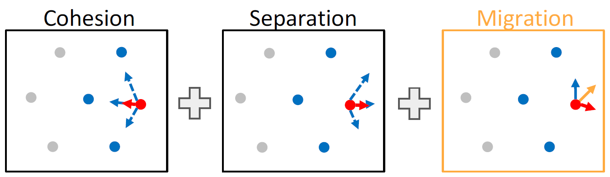

- Equation

  $\ddot{\mathbf{p}}_{i}=\mathbf{u}_{i}$, $\mathbf{u}_{i}=c_{c} \frac{\sum_{j \in N_{i}}\left(\mathbf{p}_{j}-\mathbf{p}_{i}\right)}{\left|N_{i}\right|}-c_{s} \frac{\sum_{j \in N_{i}} \frac{\mathbf{p}_{j}-p_{i}}{\left\|p_{j}-p_{i}\right\|^{2}}}{\left|N_{i}\right|}+c_m \frac{\mathbf{v}_{mig}-\dot{\mathbf{p}}_i}{1}$

  $\forall i \in\{1,2, \ldots, N\}$

  - parameters
    - migration velocity $\mathbf{v}_{mig}$
    - Denominator = 1 since **neighbors are not relevant for migration**

## Case: Aerial swarms for disaster mitigation

SMAV platform with control electronics

### Communication radius and turning angle

- large communication radius -> can make sharp turn together because of knowing the position of other robots
- smaller communication radius -> may separate and gather into a flocking often

### Virtual agents for flocking with fixed-wing drones

- Winged drone flies around Virtual Agent which moves according to Reynolds rules

  

- Varga et al., Distributed Formation Control of Fixed Wing Micro Aerial Vehicles for Uniform Area Coverage, IROS 2015

  video: <https://youtu.be/FYsd2VckGA0>

## Reynolds flocking with obstacles (Virtual agents)

- Obstacles are modelled as **virtual agents**

  - Its **position** is the obstacle’s **closest point** to the agent
  - Its **velocity** is **perpendicular to the tangent** to the obstacle

  $(\mathbf{p}_k, \dot{\mathbf{p}}_k)$ position and velocity of the virtual agent

- Virtual agents exert **separation** and **alignment** effects, but not **cohesion** (not collide with the agent)

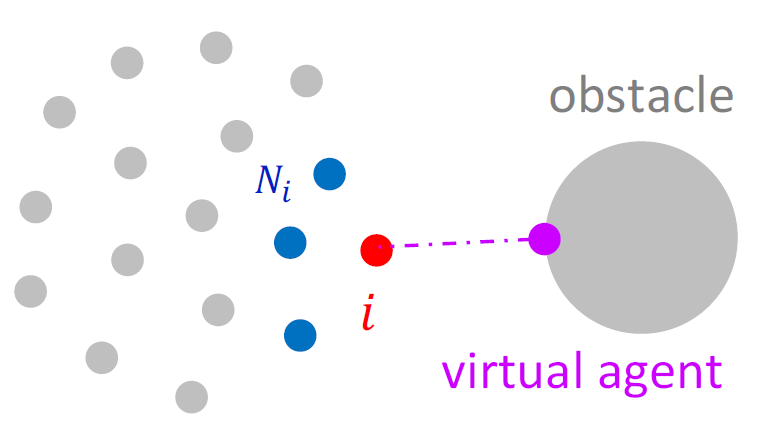

- Visualization

  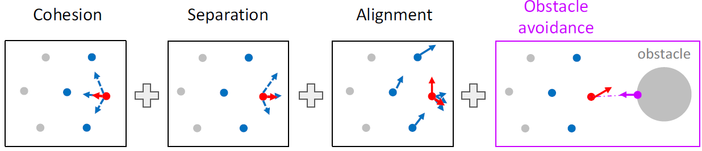

- Equation (two extra separation and alignment term regarding obstacles)

  $\ddot{\mathbf{p}}_{i}=\mathbf{u}_{i}$

  $\mathbf{u}_{i}=c_{c} \frac{\sum_{j \in N_{i}}\left(\mathbf{p}_{j}-\mathbf{p}_{i}\right)}{\left|N_{i}\right|}-c_{s} \frac{\sum_{j \in N_{i}} \frac{\mathbf{p}_{j}-p_{i}}{\left\|p_{j}-p_{i}\right\|^{2}}}{\left|N_{i}\right|}+c_a \frac{\mathbf{v}_{mig}-\dot{\mathbf{p}}_i}{1} -\left[c_s \frac{\mathbf{p}_k - \mathbf{p}_i}{\Vert \mathbf{p}_k - \mathbf{p}_i \Vert^2} + c_a (\dot{\mathbf{p}}_k - \dot{\mathbf{p}}_i)\right]$

  $\forall i \in\{1,2, \ldots, N\}$

## Other models

### Vicsek model: particles in confined environments (密闭环境)

> Vasarhelyi et al., Optimized flocking of autonomous drones in confined environments, Science Robotics, 2019
>
> DOI: <http://doi.org/10.1126/scirobotics.aat3536>
>
> Video: https://youtu.be/E4XpyG4eMKE
>
> Project web: http://hal.elte.hu/drones/scirob2018.html

- Rules
  - **Separation**
  - **Self propulsion**: Makes the agent match a preferred speed
  - **Friction**: **Viscosity** (internal friction) for alignment and oscillation **damping**

- Equation

  $\left\{\begin{array}{l}\dot{\boldsymbol{p}}_{i}=\boldsymbol{u}_{i} \\ \boldsymbol{u}_{i}=\boldsymbol{v}_{s e p, i}+\boldsymbol{v}_{s p p, i}+\boldsymbol{v}_{\text {fric }, i}\end{array}\right.$

- The full equation contains 12 parameters and **requires heuristic methods for optimization**

### Olfati-Saber model

> R. Olfati-Saber, Flocking for multi-agent dynamic systems: algorithms and theory, IEEE Transactions
> on Automatic Control, 2006

+ Rules

  + Distance matching
    + Makes the agents **match a desired inter-agent distance**
    + **Replaces cohesion and separation** rules of Reynolds model
    + Mathematically defined as a potential function
  + Alignment: attempt to match the velocity and direction

  

+ Equation

  $\ddot{\mathbf{p}}_{i}=\mathbf{u}_{i}$

  $\mathbf{u}_{i}=c_{d} \frac{\sum_{j \in N_{i}} \nabla \left(\rho(\mathbf{p}_{j}-\mathbf{p}_{i}) V (\Vert \mathbf{p}_{j}-\mathbf{p}_{i}\Vert) \right)}{\left|N_{i}\right|}-c_{a} \frac{\sum_{j \in N_{i}} (\dot{\mathbf{p}}_{j}-\dot{\mathbf{p}}_{i})}{\left|N_{i}\right|}$

  $\forall i \in\{1,2, \ldots, N\}$

  + radius of influence $R$
  + desired inter-agent distance $d_{ref}$
  + weighting function $\rho$
  + distance matching function $V$
  + gradient, derivative in three dimensions $\nabla=\left(\frac{\partial}{\partial x}, \frac{\partial}{\partial y}, \frac{\partial}{\partial z}\right)$

+ **distance matching example**

  + Components
    + **weighting** function 越近影响越大
    + **distance matching** function 越靠近$d_{ref}$越小，线性
    + Result: **potential function**

  

  + Note
    + Principle of minimum potential: **minimum** defines the stable equilibrium of the system
    + $d_{ref}$ is a stable equilibrium
    + The force acting on an agent is zero in the minimum of the potential. For $d=d_{ref}$, it holds $\nabla(\rho V)=\mathbf{0}$

## Drone Swarms

> Coppola et al., A Survey on Swarming With Micro Air Vehicles: Fundamental Challenges and Constraints, Front. Robot. AI, ‘20

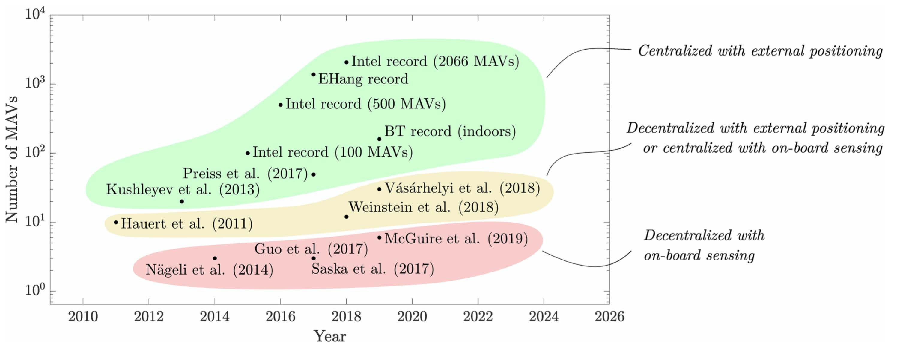

The combination of centralized planning/control with external positioning has **allowed to fly significantly larger swarms**. The **numbers are lower** for the **works featuring decentralized control with external positioning**, or centralized control with local sensing

**Three categories**

1. Centralized with external positioning

   > latest: September 20 2020
   >
   > 3,051 drones
   >
   > News: https://www.guinnessworldrecords.com/news/2020/10/3051-drones-create-spectacular-record-breaking-light-show-in-china (Company: https://www.dmduav.com/)
   >
   > YouTube: https://youtu.be/44KvHwRHb3A
   >
   > Bilibili: https://www.bilibili.com/video/BV1jt4y1q762

2. Decentralized with external positioning or centralized with on-board sensing

   Vasarhelyi et al. (2019)

3. Decentralized with on-board sensing

   Saska et al. (2017)

## Visual information in flocking

### Soria2019IRC-influence of limited visual sensing using Reynolds

> Soria et al., The influence of limited visual sensing on the Reynolds flocking algorithm, 2019

- generate flocks with different fields of view

  

  - azimuth/方位角 $\theta [^{\circ}]$
  - width $\alpha [^{\circ}]$

  

- measure flocking performance (all individuals in the flock have the same visual configuration)

  - **Order**: measure of alignment
  - **Safety**: ability to avoid collisions
  - **Union**: ability to stay informed on neighbors
  - **Connectivity**: ability to broadcast messages among drones

  

- results

  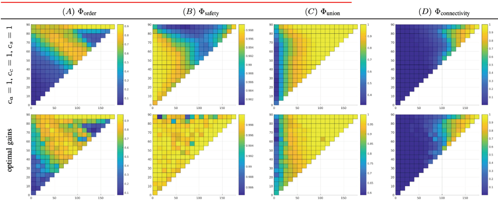

  - focus on order and safety (alignment and collision prevention capability)
  - largest azimuth and FoV has best performance
  - increase in either azimuth or FoV only will degrade the performance
  - safety can be achieved even with lower FoV

### Schilling2019RAL-Learning to flock in simulation with vision

> Schilling et al., Learning Vision-Based Flight in Drone Swarms by Imitation, RAL2019

- use 6 cameras in each side

- training on a dataset to generate the velocity vector for the drone

- Stages
  - Dataset generation: Flocking algorithm as ground truth
  - Training phase: Learn **mapping between vision and control output**
  - Vision-based control: **Neural controller for collision-free and cohesive flight**
- Note
  - work well in simulation indoor environment
  - it can be robust when individuals has different migration points
  - cannot generalize well in background clutter and different lighting condition

### Schilling2021RAL-Learning to flock outdoor with vision

> Schilling et al., Vision-Based Drone Flocking in Outdoor Environments, RAL2021 

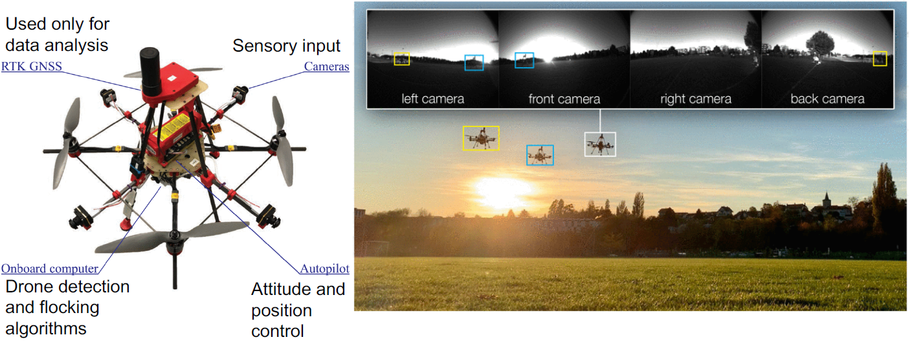

- Setup

  - Drone with only with 4 cameras in four side
  - RTK GNSS is used to compute performance
  - train YOLOv3 tiny to recognize other drones using YOLO

- Control method

  

  1. Real-time drone detection

     - Input: images from 4 cameras

     - Output: x,y coordinates of perceived drones in image frame coordinates

       known size to compute corresponding distance

  2. Multi-agent state tracking

     - Input: Locations of drones & noise models

     - Output: **Range and bearing** of all perceived drones with **noise**

  3. Potential-field-based control

     - Input: Range and bearing of all perceived drones
     - Output: **velocity vector** resulting from Reynolds algorithm

## Check points

- What information does each agent receive in the Reynolds flocking algorithm?

  :construction: position and velocity of self and neighbor agents

- How are obstacles modeled in Reynold’s flocking

  visual agent; integrate into equations with alignment and separation term

- How is a migration point incorporated in flocking algorithms

  :construction: add a velocity term?

- What does the Olfati-Saber algorithm ensure?

  distance matching with potent ion function

- What are the three steps of vision-based drone flocking algorithm?

  1. Real-time drone detection

  2. Multi-agent state tracking
  3. Potential-field-based control

  images from 4 cameras -> x,y coordinates of perceived drones in images -> Range and bearing of all perceived drones -> velocity vector

# :construction: Flapping-Wing (week8)

# Drone Regulations (week8)

> Author: Markus Farner
>
> https://www.bazl.admin.ch/bazl/en/home/good-to-know/drohnen.html

- Unmanned Aircraft Systems (UAS) >= Drones; UAS  = Remotely piolted aircraft systems / autonomous aircraft systems

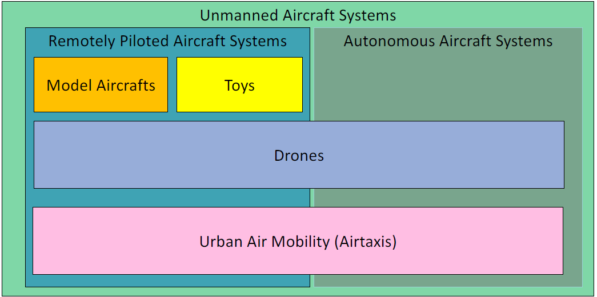

- Rules in Aviation: Federal Office of Civil Aviation Switzerland

- Everything which is not forbidden is allowed -> Switzerland

  Trust, less difficult for innovation

- 3 Pillar Concept / Drone Categories

  1. Open-Within the legal framework (No Authorization required)
  2. Specific-Not sufficiently safe (Authorization required)
  3. Certified-Approved to accepted standards

- Act

  - **Ordinance on Special Category Aircraft**
    - No authorization required for commercial flights
    - No distinction between Unmanned Aircraft and Model Aircraft
  - **DETEC Ordinance on Special Category Aircraft**
    - No authorization below **30kg**
    - Within direct visual contact (VLOS)
    - Not within a distance <=100m around crowds
  - **ANSP (Skyguide) or Airport responsibility**
    - \> **5km** Distance to civil & military airports/aerodromes
    - < **150m** AGL (Above Ground Level) within a CTR

- Act in EU
  - Open/Specific/Certified
  - Difference
    - restrictions: MTOM **25kg**
    - maximum flying altitude: **120m** 

- Specific Category

  > Application for an operating permit on the basis of the **SORA (Specific Operations Risk Assessment)**

  **Operational Volume = Flight Geography + Contingency Volume **

  

- :question: Robustness Levels: Integrity + Assurance

- U-Space

  > The U-space is a collection of decentralized services that collectively aim to safely and efficiently integrate drones into the airspace and enable drone operations alongside manned flight.
  >
  > https://www.bazl.admin.ch/bazl/en/home/good-to-know/drohnen/wichtigsten-regeln/uspace.html.html
  >
  > https://www.skyguide.ch/en/events-media-board/u-space-live-demonstration/

  airspace in block to avoid collision and report the location for further path calculation

# UAS Hardware (week9)

## Introduction

> main component required

1. The aerial vehicle
   - Air frame
   - Actuators for propulsion and control
   - Energy source
   - Autopilot
     - Sensors for attitude estimation
     - Electronics for regulation, control and communication
     - Sensor and avoid system
2. Payload
   - Cameras
   - Environmental sensors (wind, temperature, humidity)
   - Robotic arms for manipulation
3. Ground Control Station
   - Communication systems
   - Interface to monitor internal parameters and to send commands to the vehicle

## Frame and materials

### materials comparison

| Material | Composite                         | ABS/PLA                                                 | Wood                  | Foam                                          |
| -------- | --------------------------------- | ------------------------------------------------------- | --------------------- | --------------------------------------------- |
| Pros     | Stiff, lightweight                | Easy to manufacture by 3D printing or injection molding | Lightweight and cheap | Lightweight and soft, resistance to collision |
| Cons     | Expensive, complex to manufacture | Heavier, less stiff                                     | complex to work with  | limited load                                  |
| Comment  | -                                 | useful for prototyping                                  | -                     | absorb energy, less prone to damage           |

### metric when considering materials

- Young's modulus [[wiki](https://en.wikipedia.org/wiki/Young%27s_modulus)]

  弹性模量，正向应力与正向应变的比值

  - measure of **stiffness**
  - defines the relationship between stress and strain
  - Foam < ABS/PLA/Wood < Carbon fiber

  

- Specific modulus [[wiki](https://en.wikipedia.org/wiki/Specific_modulus)]

  比模量，单位密度的弹性模量，劲度－质量比，在航天工业中有广泛应用。
  
  - elastic modulus per mass density of a material
  - stiffness to weight ratio
  - **High specific modulus materials** find wide application in UAVs where **minimum structural weight** is required.
  
  

## Energy sources

> Goal: power the robots to fly
>
> Metric: energy density, power density, charging time and so on

### Category

- Nickel-Cadmium (NiCd) | 镍镉

  - Mature and cheap
  - Low energy and power density -> short flight time

- Nickel-Metal Hydrate (NiMh) | **镍氢电池**

  > 由[镍镉电池](https://zh.wikipedia.org/wiki/鎳鎘電池)（NiCd battery）改良而来的，其以能吸收氢的金属代替[镉](https://zh.wikipedia.org/wiki/镉)（Cd）。它以相同的价格提供比镍镉电池更高的电容量、较不明显的[记忆效应](https://zh.wikipedia.org/wiki/記憶效應_(電池))、以及较低的环境污染（不含有毒的镉）
  >
  > [[wiki-zh](https://zh.wikipedia.org/wiki/%E9%95%8D%E6%B0%A2%E7%94%B5%E6%B1%A0)]

  - Higher energy density than NiCd

- Lithium-Polymer (Li-Po) | 锂离子聚合物电池

  - rapidly growing market and performance
  - Higher energy and power density compared to NiCd
  - Regular geometry for easy integration, e.g., cuboid or cuboid

- Fuel

  - **Highest energy and power density**
  - **complex and higher weight**-requires tank, distribution system and maintenance

- Fuel cell

  - Electrochemical reaction of hydrogen fuel with oxygen

### Energy and power density

- energy density

  amount of energy stored per unit volume or mass

- power density

  > how fast or quickly to discharge into mechanics

  amount of power (time rate of energy) per unit volume or mass

- Conclusion

  - Fuel has **highest energy and power density**
  - Fuel cell has highest energy but lower power density
  - LiB has higher energy and power density than NiMH and NiCd

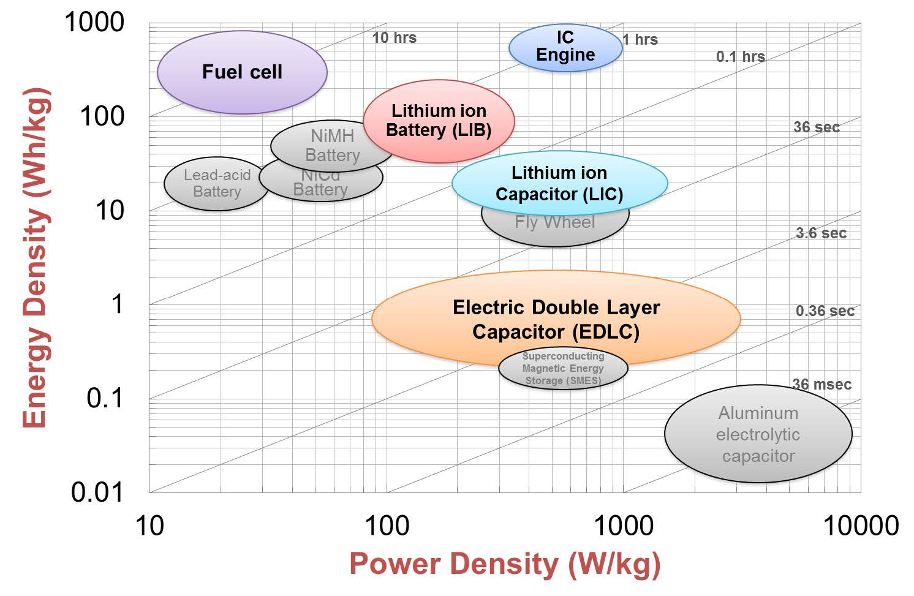

### Li-Po batteries

- most commonly-used UAV energy source

- Each **battery** composed of one or more **cells** connected in series

  S=series, P=Parallel

- Each cell has

  - nominal voltage of 3.7 V

  - a maximum voltage of 4.2 V

  - a capacity (mAh)

    e.g., 1000 mAh

  - a specific discharge and charge rate (C)

    e.g., Discharge rate with 25-50C = 25-50 A of max continuous discharge current; Charge rate 2C = 2 A

#### Discharge Curves of Li-Po battery

- not linear of time
- the discharge curve is determined by **the amount of current (expressed in “C”)** drawn from the battery.
- higher discharge rates -> faster rising temperature -> poses overheating risks.

> **Book**: G. C. H. E. Decroon, M. Perçin, B. D. W. Remes, R. Ruijsink, and C. De Wagter, The delfly: Design, aerodynamics, and artificial intelligence of a flapping wing robot. 2015.

#### Energy Curve of Li-Po battery

- How much energy the same LiPo battery can provide until its voltage drops below a certain voltage

- 10 times higher battery load (discharge rate) -> 17 times shorter flight time

  nonlinear relationship

## Actuators

### Actuators for propulsion

|          | **Electric motors**                                          | Combustion engine                                            | Hybrid$^2$                                      |
| -------- | ------------------------------------------------------------ | ------------------------------------------------------------ | ----------------------------------------------- |
| **Pros** | clean and quite; Reliable and easy to maintain; Fast to change operational state (accelerate and decelerate) | High weight to power ratio using fuel                        | Long endurance; Suited for fast change of speed |
| **Cons** | Limited weight to power ratio due to battery                 | Vibration, dirt, and noise; Requires tuning; Not suited for fast change of speed$^1$ | Complex and expensive                           |

1. Combustion engine is not suited for fast change of speed (problem in controlling quadcopters)

2. Hybrid systems (fuel generator coupled with electric motor)

   e.g. [skyfront](https://skyfront.com/product-list) drone with 4.5 hour endurance (demonstrated) and 3 kg payload capacity

#### Electric motor example-Brushless DC electric motors

- Brushless: no electrical physical connection
- Pros
  - High efficiency and high torque/power density
  - High speed range
  - Large range of thrust (from $10^{-2}$ to $10^{2}$ N)
- Cons
  - manufacturing complexity -> expensive
  - Control is complex and expensive requiring and **electronic speed controller (ESC, 电控)**
- Main motor data
  - 3 primary data: 
    - Size
    - **Nominal** voltage (number of battery cells, e.g., 3S)
    - Speed constant KV (No load rpm/Volt)
      - High KV -> high speed and low torque
      - Low KV -> low speed and high torque

### Actuators for control/maneuvering

#### Servomotors

> need to deflect the control surfaces

- rotary or linear actuators

- 3 wires (B-Ground, R-Voltage, Y-Signal) - send power and signal to control circuit

- brush motor in small scale and connected to gear drive (set correct speed and torque, connect to potentiometer)

  potentiometer (电位器) sensor for angular position control

#### Examples of Servomotors

| <u>Rotary servos</u> with push rod                           | Linear servos                                                |
| ------------------------------------------------------------ | ------------------------------------------------------------ |
| 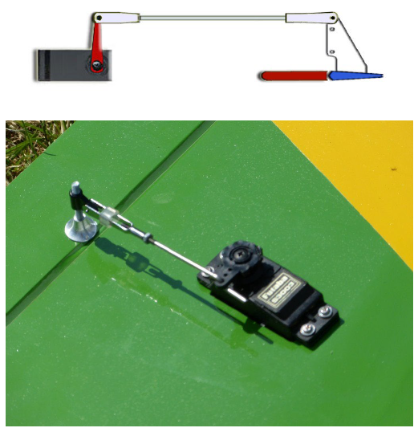 | 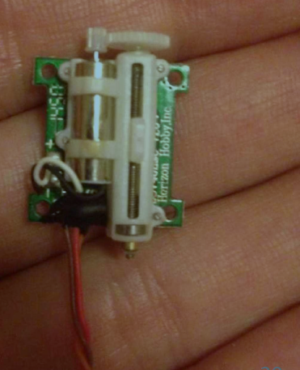 |
| Weight: 1 to 500 g                                           | Weight: 1 to 5 g                                             |
| -                                                            | to control elevators, flaps and ailerons                     |

## Propellers

> to convert power (delivered by a rotating shaft) into thrust

### Characteristics

- Diameter
  - the length of prop from tip to tip
  - larger diameter are more efficient
- Pitch
  - the angle of attack in the propellers
  - higher at the root (center) and lower at the tip
- Number of blades
  - majority of propellers used in UAVs have two blades because of efficiency
  - 3 or 4 blades are more compact for a given thrust

### Pitch and efficiency at different cruise speed

- the blade pitch could be varied in flight  

- propeller advance ratio $J$ VS Propeller efficiency $\eta_p$

  $J= V/nD$, **flight** speed $V$, **angular** speed $n$, and Diameter D -> tip speed

  choose the suitable propeller according to the **diameter and pitch** to achieve better **efficiency curve**

  

- **Variable pitch propeller with servo** -> achieve best efficiency all the time

  

### Choose the right combination actuator and propeller

> match the propeller and the motor to maximize propulsive efficiency

- modelling (http://web.mit.edu/drela/Public/web/qprop/motorprop.pdf)
- calculation software (http://ecalc.ch/)
- testing

## Sensors

- Proprioceptive sensors: measure the internal state of the UAV, mainly for control
  - IMU: accelerometer, gyroscope and magnetometer
  - Pressure / altitude sensors
  - GPS
  - Velocity (Airspeed sensors)
  - Power sensor
- Exteroceptive sensors: provide information about the UAS environment and are usually carried as a payload
  - Camera and sonar for obstacle detection and avoidance
  - Environmental sensors
  - Camera for video streaming, thermal or hyperspectral imaging

### Gyroscopes

> measure changes in vehicle orientation

- Type: Mechanical; Optical; Micro-electromechanical systems (MEMS)

- Categories

  - Orientation -> directly measure angles (very rare in robotics!)
  - Rate gyros -> measure rotation velocity, which can be integrated

- Cons

  - all gyroscopes are prone to drift unless the error is corrected through reference to some alternate measurement

    (not relative to absolute reference but past state)

  - the drift will eventually exceed the required accuracy

- MEMS rate gyros

  

  - vibrating mechanical elements to sense **Coriolis acceleration** (振动机械元件以感应科里奥利加速度)

    induce an vibration outside the plane and measure the out-of-plane motion

  - Pros -> replacing mechanical and optical gyros

    - have no rotating parts
    - have low-power consumption requirements
    - small

### Accelerometers

> measure acceleration to get the inertial information

- behaves as a damped mass on a spring
- MEMS use cantilever beams (悬臂梁) and a proof mass.
- The way of measuring the beam deflection is often capacitive or piezoresistive (电容性或压阻性的)
- have three axes => inclinometers (inclinometers)

### Magnetometers

> Exteroceptive

- electronically compass 电子罗盘

- direct measure of the magnetic field

  - Hall-effect (霍尔效应)

  - Flux Gate (磁通罗盘) [[wiki](https://en.wikipedia.org/wiki/Magnetometer#Fluxgate_magnetometer)]

    two perpendicular circuits to get the force

- Pros

  - weakness of the Earth magnetic field

  - easily disturbed by magnetic objects or other sources

  - not working in indoor environments

    because of wires or other electronic device

### Pressure / Altitude sensors

> to measure the altitude according the atmosphere pressure

- measure the changing distance of the deforming membranes: piezoresistive (压阻式), capacitive, optical, electromagnetic, etc

  

- has a vacuum inside the housing to get an absolute pressure 

### Airspeed sensors

- measured using a pitot tube (皮托管)

- directed into the direction of motion

- the difference between the stagnation pressure (**static** + **dynamic** pressure) -> the airspeed

  

- measures the **speed** of a UAV with **respect to the air** (airspeed) -> used for fixed-wing UAV

  not the absolute speed of the UAV

  

### Global positioning system (GPS)

- Global Navigation Satellite System (GNSS): This term includes 

  - e.g. the GPS, GLONASS, Galileo, Beidou and other regional systems. 
  - The advantage to having access to multiple satellites is accuracy, redundancy and availability at all times.

- Relatively lower accuarcy: have a position accuracy within 20 m in the horizontal plane and 45 m in the vertical plane

- **enhancement techniques**

  - **WAAS** or other ground-based services: static

    get close to 1-2 m accuracy

  - **Real time Kinematic (RTK)** positioning: Base
    Station receiver and a receiver on the vehicle

    close to 1 cm accuracy

### Power sensors

- used to measure the battery voltage/current -> trigger safety procedures (return to home on low battery.)

### Optic flow cameras

- used to improve **state estimation** for accurate positioning and **height estimation** also in **GPS denied environments**
- measure the movements along x, y and z direction  by tracking the features
- used for obstacle avoidance, position holding, and precise landing

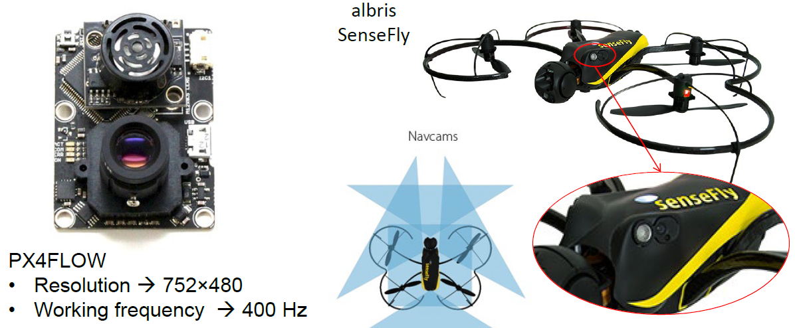

## Autopilots

## Communication protocols